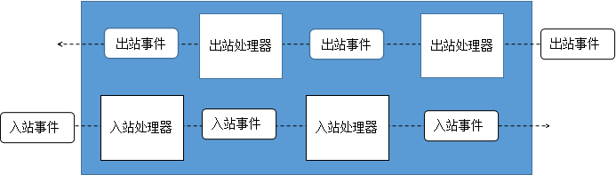
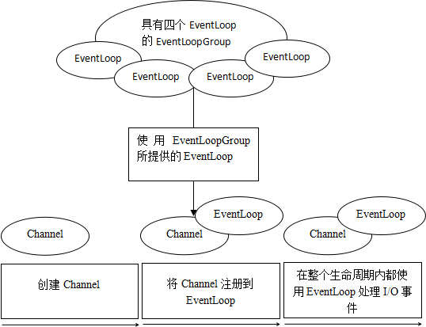
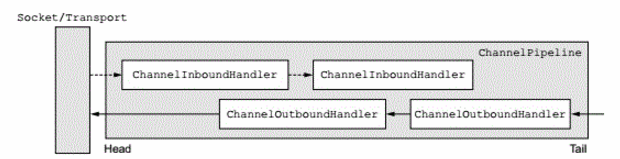
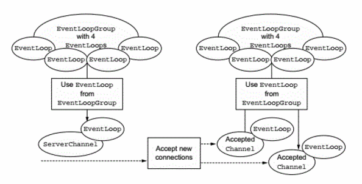

# 目录
* [一、Netty的核心组件](#一Netty的核心组件)
* [二、基于Netty的客户端和服务器](#二基于Netty的客户端和服务器)
* [三、Netty的组件和设计](#三Netty的组件和设计)

#  一、Netty的核心组件

* [1.1 Channel](#11-Channel)
* [1.2 回调](#12-回调)
* [1.3 Future](#13-Future)
* [1.4 事件和ChannelHandler](#14-事件和ChannelHandler)

## 1.1 Channel
&emsp;&emsp; Channe1是Java NIO的一个基本构造</br>
&emsp;&emsp; 它代表一个到实体(如一个硬件设备、一个文件、一个网络套接字或者一个能够执行一个或者多个不同的I/O操作的程序组件)的开放连接，如读操作和写操作。

## 1.2 回调
&emsp;&emsp; 一个回调其实就是一个方法，一个指向已经被提供给另一个方法的方法的引用。Netty在内部使用了回调;当一个回调被触发时，相关的事件可以被一个实现接口ChannelHandler的类处理。
下列的代码就是一个例子，当一个新的连接已经被建立时，ChannelHandler的channelActive()回调方法将会被调用，并将打印出一条信息。

```java
 public class ConnectHandler extends ChannelInboundHandlerAdapter{
      @Override
      public void channelActive(ChannelHandlerContext ctx)
              throws Exception{
          System.out.println("Client "+ctx.channel().remoteAddress()+" connected");
      }
 } 
```

## 1.3 Future
&emsp;&emsp;Future提供了一种在操作完成时通知应用程序的方式。这个对象可以看做是一个异步操作的结果的占位符;它将在未来某时刻完成，并提供对其结果的访问。
Netty提供了Future的实现--ChannelFuture，用于在执行异步操作的时候使用。</br>
&emsp;&emsp;ChannelFuture提供了几种额外的方法，使得可以注册一个或者多个ChannelFutureListener实例。监听器的回调方法operationComplete()，将会在对应的操作完成以后被调用。
然后监听器可以判断该操作是成功还是失败，如果失败可以检索产生的Throwable。</br>
&emsp;&emsp;下面代码清单展示了一个ChannelFuture作为一个I/O操作的一部分返回的例子。这里，connect()方法将会直接返回，而不会阻塞，该调用将会在后台完成。
```java
Channel channel = ...;
ChannelFuture future = channel.connect(new InetSocketAddress("192.168.0.1"，25));//异步的连接到远程节点
```
&emsp;&emsp;下面代码清单展示了一个ChannelFutureListener。首先，要连接到远程节点上。然后，要注册一个新的ChannelFutureListener到对connect()方法的调用返回的ChannelFuture上。
当该监听器被通知连接已经建立的时候，检查对应状态，如果操作成功，则将数据写到该Channel。否则从ChannelFuture中检索对应的Throwable。
```java
Channel channel = ...;
ChannelFuture future = channel.connect(new InetSocketAddress("192.168.0.1"，25));//异步的连接到远程节点
future.addListener(new ChannelFutureListener(){//注册一个ChannelFutureListener，以便在操作完成时获得通知
  @Override
  public void operationComplete(ChannelFuture future){//检查操作的状态
      if(future.isSuccess()){//如果操作成功，则创建一个ByteBuf以持有数据
	      ByteBuf buffer = Unpooled.copiedBuffer("Hello"，Charset.defaultCharset);
		  ChannelFuture wf = future.channel().writeAndFlush(buffer);//将数据异步的发送到远程节点，返回一个ChannelFuture
		  ....
	  }else{
	      Throwable cause = future.cause();//如果发生错误，则访问描述原因的Throwable
		  cause.printStackTrace();
	  }
  }
});
```

## 1.4 事件和ChannelHandler
&emsp;&emsp;Netty是一个网络编程框架，所以事件是按照他们与入站或者出站数据流的相关性进行分类的。</br>
&emsp;&emsp;可能由入站数据或者相关的状态更改而触发的事件包括：
> * 连接已被激活或者连接失活
> * 数据读取
> * 用户事件
> * 错误事件

&emsp;&emsp;出站事件时未来将会触发的某个动作的操作结果,这些动作包括：
> * 打开或者关闭到远程节点的连接
> * 将数据写到或者冲刷到套接字

<br>下图展示了一个事件是如何被一个这样的ChannelHandler链处理的:<br>
<div align="center"></div><br>
&emsp;&emsp;Netty的ChannelHandler为处理器提供了基本的抽象。Netty提供了大量预定义的可以开箱即用的ChannelHandler实现，包括用于各种协议（如HTTP和SSL/TLS）的ChannelHandler。
在内部，ChannelHandler自己也使用事件和Future，使得他们也可以成为应用程序将使用的相同抽象的消费者。

# 二、基于Netty的客户端和服务器

* [2.1 编写Echo服务器](#21-编写Echo服务器)
* [2.2 编写Echo客户端](#22-编写Echo客户端)

## 2.1 编写Echo服务器
&emsp;&emsp;所有的Netty服务器都需要一下两个部分：
> * 至少一个ChannelHandler----该组件实现了服务器对从客户端接收的数据的处理，即它的业务逻辑。
> * 引导----这是配置服务器的启动代码。至少，它会将服务器绑定到它要监听连接请求的端口上。

### 2.1.1 ChannelHandler和业务逻辑
&emsp;&emsp;ChannelHandler是一个接口族的父接口，它的实现负责接收并响应事件通知。在Netty应用程序中，所有数据处理逻辑都包含在这些核心抽象的实现中。其中关键点有以下几点
* 针对不同类型的事件来调用ChannelHandler；
* 应用程序通过实现或扩展ChannelHandler来挂钩到事件的生命周期，并且提供自定义的应用程序逻辑；
* 在架构上，ChannelHandler有助于保持业务逻辑与网络处理代码的分离。

&emsp;&emsp;由于Echo服务器会响应传入的消息，所以它需要实现ChannelInboundHandler接口，用来定义响应入站事件的方法。
ChannelInboundHandlerAdapter类是ChannelInboundHandler的默认实现，因此继承它就可以了。简单的实现如下：
```java
 @Sharable   //标记一个ChannelHandler可以被多个Channel安全地共享
 public class EchoServerHandler extends ChannelInboundHandlerAdapter{
     //channelRead方法对于每个传入的消息都要调用
     @Override
	 public void channelRead(ChannelHandlerContext ctx,Object msg){
	      ByteBuf in = (ByteBuf)msg;
		  System.out.println("Server received: "+in.toString(CharsetUtil.UTF_8));
		  ctx.write(in);   //将接收到的消息写给发送者，而不冲刷出站消息
	 }
	 //通知ChannelInboundHandler最后一次对channelRead()的是当前批量读取中的最后一条消息
	 @Override
	 public void channelReadComplete(ChannelHandlerContext ctx){
	      ctx.writeAndFlush(Unpooled.EMPTY_BUFFER)
		       .addListener(ChannelFutureListener.CLOSE);   //将未决消息冲刷到远程节点,而且关闭该Channel
	 }
	 //在读取操作期间，有异常抛出时会调用
	 @Override
	 public void exceptionCaught(ChannelHandlerContext ctx,Throwable cause){
	     cause.printStackTrace();   //打印异常栈跟踪
         ctx.close();		        //关闭该Channel
	 }
 }
```
> **如果不捕获异常:**<br>
>> &emsp;&emsp;每个Channel都提供了一个与之相关联的ChannelPipeline，其持有一个ChannelHandler的实例链。在默认的情况下，ChannelHandler会把对它的方法调用转发给链中的下一个ChannelHandler。
>> 因此，如果exceptionCaught()方法没有被该链中的某处实现，那么所接受的异常将会被传递到ChannelPipeline的尾部并被记录。因此应用程序至少应该提供一个实现了exceptionCaught()方法的
>> ChannelHandler。

### 2.1.2 引导服务器
&emsp;&emsp;引导服务器的过程有以下内容：
* 绑定到服务器将在其上监听并接受传入连接请求的端口；
* 配置Channel，以将有关的入站消息通知给EchoServerHandler实例

EchoServer类的完整代码：
```java
public class EchoServer{
     private final int port;
	 
	 public EchoServer(int port){
	     this.port=port;
	 }
	 
	 public static void main(String[] args) throws Exception{
         if(args.length != 1){
		     System.err.println("Usage: "+EchoServer.class.getSimpleName()+"<port>");
			 return;
		 }
		 int port = Integer.parseInt(args[0]); //设置端口值(如果端口参数的格式不正确，则抛出一个NumberFormatException)
		 new EchoServer(port).start(); //调用服务器的start()方法
	 }	 
	 
	 public void start() throws Exception{
	     final EchoServerHandler serverHandler = new EchoServerHandler();
		 EventLoopGroup group = new NioEventLoopGroup(); //定义NioEventLoopGroup来接受和处理新的连接。
		 try{
		    ServerBootstrap b  = new ServerBootstrap();
			b.group(group)
			    .channel(NioServerSocketChannel.class)
				.localAddress(new InetSocketAddress(port))
				.childHandler(new ChannelInitializer<SocketChannel>(){ //添加一个EchoServer到子Channel的ChannelPipeline
				     @Override
					 public void initChannel(SocketChannel ch) throws Exception{
					       ch.pipeline().addLast(serverHandler); //EchoServerHandler被标注为@Shareable，所以可以总是使用同样的实例
					 }
				});
		    ChannelFuture f = b.bind().sync();  //异步地绑定服务器；调用sync()方法阻塞等待直到绑定完成
			f.channel().closeFuture().sync();   //获取Channel的CloseFuture，并且阻塞当前线程直到它完成
		 }finally{
		    group.shutdownGracefully().sync();  //关闭EventLoopGroup释放所有的资源
		 }
	 }
}
```
&emsp;&emsp;当一个新的连接被接受时，一个新的子Channel将会被创建，而ChannelInitializer将会把一个你的EchoServerHandler的实例添加到该Channel的ChannelPipeline中。
这个ChannelHandler将会收到有关入站消息的通知。

## 2.2 编写Echo客户端
Echo客户端将会：
1. 连接到服务器；
2. 发送一个或多个消息；
3. 对于每个消息，等待并接受从服务器发回的相同的消息；
4. 关闭连接

### 2.2.1 通过ChannelHandler实现客户端逻辑
&emsp;&emsp;客户端将拥有一个用来处理数据的ChannelInboundHandler，在该场景下通过扩展SimpleChannelInboundHandler类以处理所有必须的任务。
```java
@Sharable
public class EchoClientHandler extends SimpleChannelInboundHandler<ByteBuf>{
  @Override
  public void channelActive(ChannelHandlerContext ctx){
     ctx.writeAndFlush(Unpooled.copiedBuffer("Netty rocks!",CharsetUtil.UTF_8));//当被通知Channel是活跃的时候，发送一条消息
  }
  
  @Override
  public void channelRead0(ChannelHandlerContext ctx,ByteBuf in){
     System.out.println("Client received: "+in.toString(CharsetUtil.UTF_8)); //记录已接收消息的转储
  }
  
  @Override
  public void exceptionCaught(ChannelHandlerContext ctx,Throwable cause){
     cause.printStackTrace();
	 ctx.close();
  }
}
```
&emsp;&emsp;首先，重写channelActive()方法，其将在一个连接建立时被调用。接下来重写channelRead0()方法，每当接收数据时，都会调用这个方法。
但是由于服务器发送的消息可能会被分块接收，因此channelRead0()方法可能会被调用多次。

### 2.2.2 引导客户端
&emsp;&emsp;引导客户端类似于引导服务器，不同的是，客户端是使用主机和端口参数来连接远程地址，也就是Echo服务器的地址，而不是绑定到一个一直被监听的端口。
```java
public  class EchoClient{
    private final String host;
	private final int port;
	
	public EchoClient(String host,int port){
	    this.host = host;
		this.port = port;
	}
	
	public void start() throws Exception{
	    EventLoopGroup group = new NioEventLoopGroup();
		try{
		    Bootstrap b = new Bootstrap();
			b.group(group)
			    .channel(NioSocketChannel.class)  //适用于NIO传输的Channel类型
				.remoteAddress(new InetSocketAddress(host,port))
				.handler(new ChannelInitializer<SocketChannel>(){
				   @Override
				   public void initChannel(SocketChannel ch) throws Exception{
				       ch.pipeline().addLast(new EchoClientHandler());
				   }
				});
		    ChannelFuture f = b.connect().sync();
			f.channel().closeFuture().sync();
		}finally{
		    group.shutdownGracefully().sync();
		}
	}
	
	public static void main(String[] args) throws Exception{
	    if(args.length != 2){
		   System.err.println("Usage: "+EchoClient.class.getSimpleName()+"<host> <port>");
		   return;
		}
		String host = args[0];
		int port = Integer.parseInt(args[1]);
		new EchoClient(host.port).start();
	}
}
```

# 三、Netty的组件和设计
* [3.1 Channel、EventLoop和ChannelFuture](#31-Channel、EventLoop和ChannelFuture)
* [3.2 ChannelHandler和ChannelPipeline](#32-ChannelHandler和ChannelPipeline)
* [3.3 引导](#33-引导)

## 3.1 Channel、EventLoop和ChannelFuture
* Channel ---- Socket;
* EventLoop ---- 控制流、多线程处理、并发
* ChannelFuture ---- 异步通知
### 3.1.1 Channel接口
&emsp;&emsp;基本的I/O操作(bind()、connect()、read()和write())依赖于底层网络传输所提供的原语。Netty的Channel接口所提供的API,大大地降低了直接使用Socket类的复杂性。
此外，Channel也拥有许多预定义的、专门化实现的广泛类层次结构的根，例如：
* EmbeddedChannel
* LocalServerChannel
* NioDatagramChannel
* NioSctpChannel
* NioSocketChannel

### 3.1.2 EventLoop接口
&emsp;&emsp;EventLoop定义了Netty的核心抽象，用于处理连接的生命周期中所发生的事件。Channel、EventLoop、Thread以及EventLoopGroup之间的关系见下图。
<div align="center"></div><br>

如上图所示：
1. 一个EventLoopGroup包含一个或者多个EventLoop；
2. 一个EventLoop在它的生命周期内只和一个Thread绑定；
3. 所有由EventLoop处理的I/O事件都将在它专有的Thread上被处理；
4. 一个Channel在它的生命周期内只注册于一个EventLoop；
5. 一个EventLoop可能会被分配给一个或多个Channel；

### 3.1.3 ChannelFuture接口
&emsp;&emsp;Netty提供了ChannelFuture接口，其addListener()方法注册了一个ChannelFutureListener，以便在某个操作完成时(无论成功与否)得到通知。

## 3.2 ChannelHandler和ChannelPipeline
* [3.2.1 ChannelHandler接口](#321-ChannelHandler接口)
* [3.2.2 ChannelPipeline接口](#322-ChannelPipeline接口)
* [3.2.3 编码器和解码器](#323-编码器和解码器)
* [3.2.4 抽象类SimpleChannelInboundHandler](#324-抽象类SimpleChannelInboundHandler)

### 3.2.1 ChannelHandler接口
&emsp;&emsp;从应用程序开发人员的角度，Netty的主要组件是ChannelHandler，它充当了所有处理入站和出站数据的应用程序逻辑的容器。Netty以适配器类的形式提供了大量默认的ChannelHandler实现，
这些适配器类自动的将事件转发到链中的下一个ChannelHandler，所以只需重写需要特殊处理的方法和事件。编写自定义ChannelHandler时经常用到的适配器类有：
* ChannelHandlerAdapter
* ChannelInboundHandlerAdapter
* ChannelOutboundHandlerAdapter
* ChannelDuplexHandler

### 3.2.2 ChannelPipeline接口
&emsp;&emsp;ChannelPipeline为ChannelHandler链提供了容器，并定义了用于在该链上传播入站和出站事件流的API。当Channel被创建时，它会被自动的分配到它专属的ChannelPipeline。<br>

ChannelHandler安装到ChannelPipeline中的过程如下：
* 一个ChannelInitializer实现被注册到ServerBootstrap中；
* 当ChannelInitializer.initChannel()方法被调用时，ChannelInitializer将在ChannelPipeline中安装一组自定义的ChannelHandler；
* ChannelInitializer将它自己从ChannelPipeline中移除；

&emsp;&emsp;ChannelHandler是专为支持广泛的用途而设计的，可以将它看做是处理往来ChannelPipeline事件(包括数据)的任何代码的通用容器。
使得事件流经ChannelPipeline是在应用程序初始化之初或引导阶段被安装的一些ChannelHandler的工作。这些ChannelHandler接受事件，执行它们实现的处理逻辑，并将数据传递给链中的下一个ChannelHandler。<br>
&emsp;&emsp;下图说明了一个Netty应用程序中入站和出站数据流之间的区别。从一个客户端应用程序的角度，如果事件的运动方向是从客户端到服务端，则称这些事件为出站的，反之则称为入站的。
出站与入站的ChannelHandler可以安装进同一个ChannelPipeline中。如果一个消息或者任何其他入站事件被读取，那么会从ChannelPipeline的头部开始流动直到ChannelPipeline的尾端。
数据的出站运动(即正在被写的数据)在概念上也是一样的。这种情况下，数据将从ChannelOutboundHandler链的尾端开始流动，直到达链的头部为止。在这之后，出站数据将会到达网络传输层。
<div align="center"></div><br>

&emsp;&emsp;虽然ChannelInboundHandler和ChannelOutboundHandler都扩展自ChannelHandler，但是Netty能区分他们的不同并确保数据只会在具有相同定向类型的两个ChannelHandler之间传递。<br>
&emsp;&emsp;当ChannelHandler被添加到ChannelPipeline时，它将被分配一个ChannelHandlerContext，代表了ChannelHandler和ChannelPipeline之间的绑定。虽然这个对象可以被用于获取底层的Channel，
但是它主要还是被用于写出站数据。<br>
&emsp;&emsp;在Netty中，有两种发送消息的方式。可以直接写到Channel中，也可以写到和ChannelHandler相关联的ChannelHandlerContext对象中。
前一种方式将会导致消息从ChannelPipeline的尾端开始流动，而后者将导致消息从ChannelPipeline中的下一个ChannelHandler开始流动。

### 3.2.3 编码器和解码器
&emsp;&emsp;当通过Netty发送或者接收一个消息时就会发生一次数据转换。入站消息会被解码，即从字节转换成另一种格式，通常是一个java对象。
如果是出站消息，则会发生相反方向的转换：它将从它的当前格式编码为字节。<br>
&emsp;&emsp;对应于特定的需求，Netty为编码器和解码器提供了不同类型的抽象类。例如，应用程序可能使用了一种中间格式，而不需要立即将消息转换成字节。但仍然需要一个编码器，
只是它将派生自一个不同的超类。为了确定合适的编码器类型，可以应用一个简单的命名约定 <br>
&emsp;&emsp;通常来说，这些基类的名称将类似于ByteToMessageDecoder或MessageToByteEncoder。对于特殊类型，
会发现类似于ProtobufEncoder和ProtobufDecoder这样的名称----预置用于支持Google的Protocol Buffers。<br>
&emsp;&emsp;所有由Netty提供的编码器/解码器适配器类都实现了ChannelOutboundHandler或者ChannelInboundHandler接口。对于每个从入站Channel读取的消息，重写的channelRead方法都会被调用。
随后，它将调用预置解码器所提供的decode()方法，并将已解码的字节转发给ChannelPipeline中的下一个ChannelInboundHandler。出站消息的模式则是相反方向的：编码器将消息转换为字节，
并将它们转发给下一个ChannelOutboundHandler。

### 3.2.4 抽象类SimpleChannelInboundHandler
&emsp;&emsp;最常见的开发场景中，要利用一个ChannelHandler来接收解码消息，并对数据应用业务逻辑。这时，只需要扩展基类SimpleChannelInboundHandler<T>，其中T是要处理的消息的java类型。
在这个ChannelHandler中，需要重写基类的一个或者多个方法，并获取一个到ChannelHandlerContext的引用，这个引用将作为输入参数传递给ChannelHandler的所有方法。<br>
&emsp;&emsp;在这种类型的ChannelHandler中，最重要的方法是channelRead0(ChannelHandlerContext,T)。除了要求不阻塞当前的I/O线程之外，其具体实现完全取决于开发人员。

## 3.3 引导
&emsp;&emsp;Netty的引导类为应用程序的网络层配置提供了容器，这涉及将一个进程绑定到某指定的端口(引导一个服务器)，或者将一个进程连接到另一个运行在某个指定主机的指定端口上的进程(引导一个客户端)。<br>
&emsp;&emsp;因此一共有两种引导类，一个是Bootstrap(用于客户端)，一种是ServerBootstrap(用于服务器)。无论程序使用哪一种协议或者处理哪种类型的数据；唯一决定使用哪种引导类的是它是作为一个客户端还是作为一个服务器。<br>

> 下表是两种引导类的比较:

|类别|Bootstrap|ServerBootstrap|
|:-:|:-:|:-:|
|网络编程中的作用|连接到远程主机和端口|绑定到一个本地端口|
|EventLoopGroup的数目|1|2|

&emsp;&emsp;ServerBootstrap需要两个EventLoopGroup(或者使用同一个EventLoopGroup)，是因为服务器需要两组不同的Channel，第一组只包含一个ServerChannel，代表服务器自身的
已经绑定到某个本地端口的正在监听的套接字。而第二组将包含所有已创建的用来处理传入客户端连接的Channel。下图说明了该模型。
<div align="center"></div><br>

&emsp;&emsp;与ServerChannel相关联的EventLoopGroup将分配一个负责为传入连接请求创建Channel的EventLoop。一旦连接被接受，第二个EventLoopGroup就会给它的Channel分配一个EventLoop。
