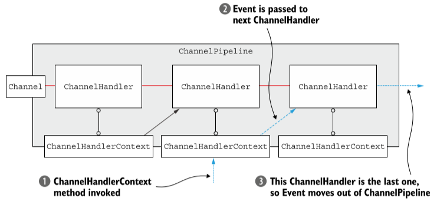

# 目录
* [一、Netty的核心组件](#一Netty的核心组件)
* [二、基于Netty的客户端和服务器](#二基于Netty的客户端和服务器)
* [三、Netty的组件和设计](#三Netty的组件和设计)
* [四、传输](#四传输)
* [五、ByteBuf](#五ByteBuf)
* [六、ChannelHandler和ChannelPipeline](#六ChannelHandler和ChannelPipeline)

#  一、Netty的核心组件

* [1.1 Channel](#11-Channel)
* [1.2 回调](#12-回调)
* [1.3 Future](#13-Future)
* [1.4 事件和ChannelHandler](#14-事件和ChannelHandler)

## 1.1 Channel
<a style="float:right;" href="#目录">回到主目录</a><br>
&emsp;&emsp; Channe1是Java NIO的一个基本构造</br>
&emsp;&emsp; 它代表一个到实体(如一个硬件设备、一个文件、一个网络套接字或者一个能够执行一个或者多个不同的I/O操作的程序组件)的开放连接，如读操作和写操作。

## 1.2 回调
<a style="float:right;" href="#目录">回到主目录</a><br>
&emsp;&emsp; 一个回调其实就是一个方法，一个指向已经被提供给另一个方法的方法的引用。Netty在内部使用了回调;当一个回调被触发时，相关的事件可以被一个实现接口ChannelHandler的类处理。
下列的代码就是一个例子，当一个新的连接已经被建立时，ChannelHandler的channelActive()回调方法将会被调用，并将打印出一条信息。

```java
 public class ConnectHandler extends ChannelInboundHandlerAdapter{
      @Override
      public void channelActive(ChannelHandlerContext ctx)
              throws Exception{
          System.out.println("Client "+ctx.channel().remoteAddress()+" connected");
      }
 } 
```

## 1.3 Future
<a style="float:right;" href="#目录">回到主目录</a><br>
&emsp;&emsp;Future提供了一种在操作完成时通知应用程序的方式。这个对象可以看做是一个异步操作的结果的占位符;它将在未来某时刻完成，并提供对其结果的访问。
Netty提供了Future的实现--ChannelFuture，用于在执行异步操作的时候使用。</br>
&emsp;&emsp;ChannelFuture提供了几种额外的方法，使得可以注册一个或者多个ChannelFutureListener实例。监听器的回调方法operationComplete()，将会在对应的操作完成以后被调用。
然后监听器可以判断该操作是成功还是失败，如果失败可以检索产生的Throwable。</br>
&emsp;&emsp;下面代码清单展示了一个ChannelFuture作为一个I/O操作的一部分返回的例子。这里，connect()方法将会直接返回，而不会阻塞，该调用将会在后台完成。
```java
Channel channel = ...;
ChannelFuture future = channel.connect(new InetSocketAddress("192.168.0.1"，25));//异步的连接到远程节点
```
&emsp;&emsp;下面代码清单展示了一个ChannelFutureListener。首先，要连接到远程节点上。然后，要注册一个新的ChannelFutureListener到对connect()方法的调用返回的ChannelFuture上。
当该监听器被通知连接已经建立的时候，检查对应状态，如果操作成功，则将数据写到该Channel。否则从ChannelFuture中检索对应的Throwable。
```java
Channel channel = ...;
ChannelFuture future = channel.connect(new InetSocketAddress("192.168.0.1"，25));//异步的连接到远程节点
future.addListener(new ChannelFutureListener(){//注册一个ChannelFutureListener，以便在操作完成时获得通知
  @Override
  public void operationComplete(ChannelFuture future){//检查操作的状态
      if(future.isSuccess()){//如果操作成功，则创建一个ByteBuf以持有数据
	      ByteBuf buffer = Unpooled.copiedBuffer("Hello"，Charset.defaultCharset);
		  ChannelFuture wf = future.channel().writeAndFlush(buffer);//将数据异步的发送到远程节点，返回一个ChannelFuture
		  ....
	  }else{
	      Throwable cause = future.cause();//如果发生错误，则访问描述原因的Throwable
		  cause.printStackTrace();
	  }
  }
});
```

## 1.4 事件和ChannelHandler
<a style="float:right;" href="#目录">回到主目录</a><br>
&emsp;&emsp;Netty是一个网络编程框架，所以事件是按照他们与入站或者出站数据流的相关性进行分类的。</br>
&emsp;&emsp;可能由入站数据或者相关的状态更改而触发的事件包括：
> * 连接已被激活或者连接失活
> * 数据读取
> * 用户事件
> * 错误事件

&emsp;&emsp;出站事件时未来将会触发的某个动作的操作结果,这些动作包括：
> * 打开或者关闭到远程节点的连接
> * 将数据写到或者冲刷到套接字

<br>下图展示了一个事件是如何被一个这样的ChannelHandler链处理的:<br>
<div align="center"></div><br>
&emsp;&emsp;Netty的ChannelHandler为处理器提供了基本的抽象。Netty提供了大量预定义的可以开箱即用的ChannelHandler实现，包括用于各种协议（如HTTP和SSL/TLS）的ChannelHandler。
在内部，ChannelHandler自己也使用事件和Future，使得他们也可以成为应用程序将使用的相同抽象的消费者。

# 二、基于Netty的客户端和服务器

* [2.1 编写Echo服务器](#21-编写Echo服务器)
* [2.2 编写Echo客户端](#22-编写Echo客户端)

## 2.1 编写Echo服务器
<a style="float:right;" href="#目录">回到主目录</a><br>
&emsp;&emsp;所有的Netty服务器都需要一下两个部分：
> * 至少一个ChannelHandler----该组件实现了服务器对从客户端接收的数据的处理，即它的业务逻辑。
> * 引导----这是配置服务器的启动代码。至少，它会将服务器绑定到它要监听连接请求的端口上。

### 2.1.1 ChannelHandler和业务逻辑
&emsp;&emsp;ChannelHandler是一个接口族的父接口，它的实现负责接收并响应事件通知。在Netty应用程序中，所有数据处理逻辑都包含在这些核心抽象的实现中。其中关键点有以下几点
* 针对不同类型的事件来调用ChannelHandler；
* 应用程序通过实现或扩展ChannelHandler来挂钩到事件的生命周期，并且提供自定义的应用程序逻辑；
* 在架构上，ChannelHandler有助于保持业务逻辑与网络处理代码的分离。

&emsp;&emsp;由于Echo服务器会响应传入的消息，所以它需要实现ChannelInboundHandler接口，用来定义响应入站事件的方法。
ChannelInboundHandlerAdapter类是ChannelInboundHandler的默认实现，因此继承它就可以了。简单的实现如下：
```java
 @Sharable   //标记一个ChannelHandler可以被多个Channel安全地共享
 public class EchoServerHandler extends ChannelInboundHandlerAdapter{
     //channelRead方法对于每个传入的消息都要调用
     @Override
	 public void channelRead(ChannelHandlerContext ctx,Object msg){
	      ByteBuf in = (ByteBuf)msg;
		  System.out.println("Server received: "+in.toString(CharsetUtil.UTF_8));
		  ctx.write(in);   //将接收到的消息写给发送者，而不冲刷出站消息
	 }
	 //通知ChannelInboundHandler最后一次对channelRead()的是当前批量读取中的最后一条消息
	 @Override
	 public void channelReadComplete(ChannelHandlerContext ctx){
	      ctx.writeAndFlush(Unpooled.EMPTY_BUFFER)
		       .addListener(ChannelFutureListener.CLOSE);   //将未决消息冲刷到远程节点,而且关闭该Channel
	 }
	 //在读取操作期间，有异常抛出时会调用
	 @Override
	 public void exceptionCaught(ChannelHandlerContext ctx,Throwable cause){
	     cause.printStackTrace();   //打印异常栈跟踪
         ctx.close();		        //关闭该Channel
	 }
 }
```
> **如果不捕获异常:**<br>
>> &emsp;&emsp;每个Channel都提供了一个与之相关联的ChannelPipeline，其持有一个ChannelHandler的实例链。在默认的情况下，ChannelHandler会把对它的方法调用转发给链中的下一个ChannelHandler。
>> 因此，如果exceptionCaught()方法没有被该链中的某处实现，那么所接受的异常将会被传递到ChannelPipeline的尾部并被记录。因此应用程序至少应该提供一个实现了exceptionCaught()方法的
>> ChannelHandler。

### 2.1.2 引导服务器
&emsp;&emsp;引导服务器的过程有以下内容：
* 绑定到服务器将在其上监听并接受传入连接请求的端口；
* 配置Channel，以将有关的入站消息通知给EchoServerHandler实例

EchoServer类的完整代码：
```java
public class EchoServer{
     private final int port;
	 
	 public EchoServer(int port){
	     this.port=port;
	 }
	 
	 public static void main(String[] args) throws Exception{
         if(args.length != 1){
		     System.err.println("Usage: "+EchoServer.class.getSimpleName()+"<port>");
			 return;
		 }
		 int port = Integer.parseInt(args[0]); //设置端口值(如果端口参数的格式不正确，则抛出一个NumberFormatException)
		 new EchoServer(port).start(); //调用服务器的start()方法
	 }	 
	 
	 public void start() throws Exception{
	     final EchoServerHandler serverHandler = new EchoServerHandler();
		 EventLoopGroup group = new NioEventLoopGroup(); //定义NioEventLoopGroup来接受和处理新的连接。
		 try{
		    ServerBootstrap b  = new ServerBootstrap();
			b.group(group)
			    .channel(NioServerSocketChannel.class)
				.localAddress(new InetSocketAddress(port))
				.childHandler(new ChannelInitializer<SocketChannel>(){ //添加一个EchoServer到子Channel的ChannelPipeline
				     @Override
					 public void initChannel(SocketChannel ch) throws Exception{
					       ch.pipeline().addLast(serverHandler); //EchoServerHandler被标注为@Shareable，所以可以总是使用同样的实例
					 }
				});
		    ChannelFuture f = b.bind().sync();  //异步地绑定服务器；调用sync()方法阻塞等待直到绑定完成
			f.channel().closeFuture().sync();   //获取Channel的CloseFuture，并且阻塞当前线程直到它完成
		 }finally{
		    group.shutdownGracefully().sync();  //关闭EventLoopGroup释放所有的资源
		 }
	 }
}
```
&emsp;&emsp;当一个新的连接被接受时，一个新的子Channel将会被创建，而ChannelInitializer将会把一个你的EchoServerHandler的实例添加到该Channel的ChannelPipeline中。
这个ChannelHandler将会收到有关入站消息的通知。

## 2.2 编写Echo客户端
<a style="float:right;" href="#目录">回到主目录</a><br>
Echo客户端将会：
1. 连接到服务器；
2. 发送一个或多个消息；
3. 对于每个消息，等待并接受从服务器发回的相同的消息；
4. 关闭连接

### 2.2.1 通过ChannelHandler实现客户端逻辑
&emsp;&emsp;客户端将拥有一个用来处理数据的ChannelInboundHandler，在该场景下通过扩展SimpleChannelInboundHandler类以处理所有必须的任务。
```java
@Sharable
public class EchoClientHandler extends SimpleChannelInboundHandler<ByteBuf>{
  @Override
  public void channelActive(ChannelHandlerContext ctx){
     ctx.writeAndFlush(Unpooled.copiedBuffer("Netty rocks!",CharsetUtil.UTF_8));//当被通知Channel是活跃的时候，发送一条消息
  }
  
  @Override
  public void channelRead0(ChannelHandlerContext ctx,ByteBuf in){
     System.out.println("Client received: "+in.toString(CharsetUtil.UTF_8)); //记录已接收消息的转储
  }
  
  @Override
  public void exceptionCaught(ChannelHandlerContext ctx,Throwable cause){
     cause.printStackTrace();
	 ctx.close();
  }
}
```
&emsp;&emsp;首先，重写channelActive()方法，其将在一个连接建立时被调用。接下来重写channelRead0()方法，每当接收数据时，都会调用这个方法。
但是由于服务器发送的消息可能会被分块接收，因此channelRead0()方法可能会被调用多次。

### 2.2.2 引导客户端
&emsp;&emsp;引导客户端类似于引导服务器，不同的是，客户端是使用主机和端口参数来连接远程地址，也就是Echo服务器的地址，而不是绑定到一个一直被监听的端口。
```java
public  class EchoClient{
    private final String host;
	private final int port;
	
	public EchoClient(String host,int port){
	    this.host = host;
		this.port = port;
	}
	
	public void start() throws Exception{
	    EventLoopGroup group = new NioEventLoopGroup();
		try{
		    Bootstrap b = new Bootstrap();
			b.group(group)
			    .channel(NioSocketChannel.class)  //适用于NIO传输的Channel类型
				.remoteAddress(new InetSocketAddress(host,port))
				.handler(new ChannelInitializer<SocketChannel>(){
				   @Override
				   public void initChannel(SocketChannel ch) throws Exception{
				       ch.pipeline().addLast(new EchoClientHandler());
				   }
				});
		    ChannelFuture f = b.connect().sync();
			f.channel().closeFuture().sync();
		}finally{
		    group.shutdownGracefully().sync();
		}
	}
	
	public static void main(String[] args) throws Exception{
	    if(args.length != 2){
		   System.err.println("Usage: "+EchoClient.class.getSimpleName()+"<host> <port>");
		   return;
		}
		String host = args[0];
		int port = Integer.parseInt(args[1]);
		new EchoClient(host.port).start();
	}
}
```

# 三、Netty的组件和设计
* [3.1 Channel、EventLoop和ChannelFuture](#31-Channel、EventLoop和ChannelFuture)
* [3.2 ChannelHandler和ChannelPipeline](#32-ChannelHandler和ChannelPipeline)
	* [3.2.1 ChannelHandler接口](#321-ChannelHandler接口)
	* [3.2.2 ChannelPipeline接口](#322-ChannelPipeline接口)
	* [3.2.3 编码器和解码器](#323-编码器和解码器)
	* [3.2.4 抽象类SimpleChannelInboundHandler](#324-抽象类SimpleChannelInboundHandler)
* [3.3 引导](#33-引导)

## 3.1 Channel、EventLoop和ChannelFuture
<a style="float:right;" href="#目录">回到主目录</a><br>
* Channel ---- Socket;
* EventLoop ---- 控制流、多线程处理、并发
* ChannelFuture ---- 异步通知
### 3.1.1 Channel接口
&emsp;&emsp;基本的I/O操作(bind()、connect()、read()和write())依赖于底层网络传输所提供的原语。Netty的Channel接口所提供的API,大大地降低了直接使用Socket类的复杂性。
此外，Channel也拥有许多预定义的、专门化实现的广泛类层次结构的根，例如：
* EmbeddedChannel
* LocalServerChannel
* NioDatagramChannel
* NioSctpChannel
* NioSocketChannel

### 3.1.2 EventLoop接口
&emsp;&emsp;EventLoop定义了Netty的核心抽象，用于处理连接的生命周期中所发生的事件。Channel、EventLoop、Thread以及EventLoopGroup之间的关系见下图。
<div align="center"></div><br>

如上图所示：
1. 一个EventLoopGroup包含一个或者多个EventLoop；
2. 一个EventLoop在它的生命周期内只和一个Thread绑定；
3. 所有由EventLoop处理的I/O事件都将在它专有的Thread上被处理；
4. 一个Channel在它的生命周期内只注册于一个EventLoop；
5. 一个EventLoop可能会被分配给一个或多个Channel；

### 3.1.3 ChannelFuture接口
&emsp;&emsp;Netty提供了ChannelFuture接口，其addListener()方法注册了一个ChannelFutureListener，以便在某个操作完成时(无论成功与否)得到通知。

## 3.2 ChannelHandler和ChannelPipeline
<a style="float:right;" href="#目录">回到主目录</a><br>
### 3.2.1 ChannelHandler接口
&emsp;&emsp;从应用程序开发人员的角度，Netty的主要组件是ChannelHandler，它充当了所有处理入站和出站数据的应用程序逻辑的容器。Netty以适配器类的形式提供了大量默认的ChannelHandler实现，
这些适配器类自动的将事件转发到链中的下一个ChannelHandler，所以只需重写需要特殊处理的方法和事件。编写自定义ChannelHandler时经常用到的适配器类有：
* ChannelHandlerAdapter
* ChannelInboundHandlerAdapter
* ChannelOutboundHandlerAdapter
* ChannelDuplexHandler

### 3.2.2 ChannelPipeline接口
&emsp;&emsp;ChannelPipeline为ChannelHandler链提供了容器，并定义了用于在该链上传播入站和出站事件流的API。当Channel被创建时，它会被自动的分配到它专属的ChannelPipeline。<br>

ChannelHandler安装到ChannelPipeline中的过程如下：
* 一个ChannelInitializer实现被注册到ServerBootstrap中；
* 当ChannelInitializer.initChannel()方法被调用时，ChannelInitializer将在ChannelPipeline中安装一组自定义的ChannelHandler；
* ChannelInitializer将它自己从ChannelPipeline中移除；

&emsp;&emsp;ChannelHandler是专为支持广泛的用途而设计的，可以将它看做是处理往来ChannelPipeline事件(包括数据)的任何代码的通用容器。
使得事件流经ChannelPipeline是在应用程序初始化之初或引导阶段被安装的一些ChannelHandler的工作。这些ChannelHandler接受事件，执行它们实现的处理逻辑，并将数据传递给链中的下一个ChannelHandler。<br>
&emsp;&emsp;下图说明了一个Netty应用程序中入站和出站数据流之间的区别。从一个客户端应用程序的角度，如果事件的运动方向是从客户端到服务端，则称这些事件为出站的，反之则称为入站的。
出站与入站的ChannelHandler可以安装进同一个ChannelPipeline中。如果一个消息或者任何其他入站事件被读取，那么会从ChannelPipeline的头部开始流动直到ChannelPipeline的尾端。
数据的出站运动(即正在被写的数据)在概念上也是一样的。这种情况下，数据将从ChannelOutboundHandler链的尾端开始流动，直到达链的头部为止。在这之后，出站数据将会到达网络传输层。
<div align="center"></div><br>

&emsp;&emsp;虽然ChannelInboundHandler和ChannelOutboundHandler都扩展自ChannelHandler，但是Netty能区分他们的不同并确保数据只会在具有相同定向类型的两个ChannelHandler之间传递。<br>
&emsp;&emsp;当ChannelHandler被添加到ChannelPipeline时，它将被分配一个ChannelHandlerContext，代表了ChannelHandler和ChannelPipeline之间的绑定。虽然这个对象可以被用于获取底层的Channel，
但是它主要还是被用于写出站数据。<br>
&emsp;&emsp;在Netty中，有两种发送消息的方式。可以直接写到Channel中，也可以写到和ChannelHandler相关联的ChannelHandlerContext对象中。
前一种方式将会导致消息从ChannelPipeline的尾端开始流动，而后者将导致消息从ChannelPipeline中的下一个ChannelHandler开始流动。

### 3.2.3 编码器和解码器
&emsp;&emsp;当通过Netty发送或者接收一个消息时就会发生一次数据转换。入站消息会被解码，即从字节转换成另一种格式，通常是一个java对象。
如果是出站消息，则会发生相反方向的转换：它将从它的当前格式编码为字节。<br>
&emsp;&emsp;对应于特定的需求，Netty为编码器和解码器提供了不同类型的抽象类。例如，应用程序可能使用了一种中间格式，而不需要立即将消息转换成字节。但仍然需要一个编码器，
只是它将派生自一个不同的超类。为了确定合适的编码器类型，可以应用一个简单的命名约定 <br>
&emsp;&emsp;通常来说，这些基类的名称将类似于ByteToMessageDecoder或MessageToByteEncoder。对于特殊类型，
会发现类似于ProtobufEncoder和ProtobufDecoder这样的名称----预置用于支持Google的Protocol Buffers。<br>
&emsp;&emsp;所有由Netty提供的编码器/解码器适配器类都实现了ChannelOutboundHandler或者ChannelInboundHandler接口。对于每个从入站Channel读取的消息，重写的channelRead方法都会被调用。
随后，它将调用预置解码器所提供的decode()方法，并将已解码的字节转发给ChannelPipeline中的下一个ChannelInboundHandler。出站消息的模式则是相反方向的：编码器将消息转换为字节，
并将它们转发给下一个ChannelOutboundHandler。

### 3.2.4 抽象类SimpleChannelInboundHandler
&emsp;&emsp;最常见的开发场景中，要利用一个ChannelHandler来接收解码消息，并对数据应用业务逻辑。这时，只需要扩展基类SimpleChannelInboundHandler<T>，其中T是要处理的消息的java类型。
在这个ChannelHandler中，需要重写基类的一个或者多个方法，并获取一个到ChannelHandlerContext的引用，这个引用将作为输入参数传递给ChannelHandler的所有方法。<br>
&emsp;&emsp;在这种类型的ChannelHandler中，最重要的方法是channelRead0(ChannelHandlerContext,T)。除了要求不阻塞当前的I/O线程之外，其具体实现完全取决于开发人员。

## 3.3 引导
<a style="float:right;" href="#目录">回到主目录</a><br>
&emsp;&emsp;Netty的引导类为应用程序的网络层配置提供了容器，这涉及将一个进程绑定到某指定的端口(引导一个服务器)，或者将一个进程连接到另一个运行在某个指定主机的指定端口上的进程(引导一个客户端)。<br>
&emsp;&emsp;因此一共有两种引导类，一个是Bootstrap(用于客户端)，一种是ServerBootstrap(用于服务器)。无论程序使用哪一种协议或者处理哪种类型的数据；唯一决定使用哪种引导类的是它是作为一个客户端还是作为一个服务器。<br>

> 下表是两种引导类的比较:

|类别|Bootstrap|ServerBootstrap|
|:-:|:-:|:-:|
|网络编程中的作用|连接到远程主机和端口|绑定到一个本地端口|
|EventLoopGroup的数目|1|2|

&emsp;&emsp;ServerBootstrap需要两个EventLoopGroup(或者使用同一个EventLoopGroup)，是因为服务器需要两组不同的Channel，第一组只包含一个ServerChannel，代表服务器自身的
已经绑定到某个本地端口的正在监听的套接字。而第二组将包含所有已创建的用来处理传入客户端连接的Channel。下图说明了该模型。
<div align="center"></div><br>

&emsp;&emsp;与ServerChannel相关联的EventLoopGroup将分配一个负责为传入连接请求创建Channel的EventLoop。一旦连接被接受，第二个EventLoopGroup就会给它的Channel分配一个EventLoop。

# 四、传输
* [4.1 案例研究](#41-案例研究)
	* [4.1.1 不通过Netty使用OIO和NIO](#411-不通过Netty使用OIO和NIO)
	* [4.1.2 通过Netty使用OIO和NIO](#412-通过Netty使用OIO和NIO)
	* [4.1.3 非阻塞的Netty版本](#413-非阻塞的Netty版本)
* [4.2 传输API](#42-传输API)
* [4.3 内置的传输](#43-内置的传输)
* [4.4 传输的用例](#44-传输的用例)

## 4.1 案例研究
<a style="float:right;" href="#目录">回到主目录</a><br>
### 4.1.1 不通过Netty使用OIO和NIO
> 仅使用JDK API的应用程序的阻塞(OIO)版本
```java
//无法很好伸缩到支撑成千上万的并发连入连接
public class PlainOioServer{
     public void serve(int port) throws IOException{
	     final ServerBootstrap socket = new ServerBootstrap(port); //将服务器绑定到指定端口
		 try{
		    for(;;){
			   final Socket clientSocket = socket.accept(); //接受连接
			   System.out.println(
			                "Accepted connection from "+clientSocket);
			   new Thread(new Runnable(){    //创建新线程来处理该连接
			      @Override
				  public void run(){
				      OutputStream out;
					  try{
					      out = clientSocket.getOutputStream();
						  out.write("Hi!\r\n".getBytes(Charset.forName("UTF-8"))); //将消息写给已连接的客户端
						  out.flush();
						  clientSocket.close();  //关闭连接
					  }catch(IOException e){
					      e.printStackTrace();
					  }finally{
					      try{
						     clientSocket.close();
						  }catch(IOException ex){
						  }
					  }
				  }
			   }).start();  //启动线程
			}
		 }catch(IOException e){
		    e.printStackTrace();
		 }
	 }
}
```

> 仅使用JDK API的应用程序的异步(NIO)版本
```java
public class PlainNioServer{
    public void serve(int port) throws IOException {
	    ServerSocketChannel serverChannel = ServerSocketChannel.open();
		serverChannel.configureBlocking(false);
		ServerSocket ssocket = serverChannel.socket();
		InetSocketAddress address = new InetSocketAddress(port); //将服务器绑定到选定端口
		ssocket.bind(address);
		Selector selector = Selector.open(); //打开Selector来处理Channel 
		serverChannel.register(selector,SelectionKey.OP_ACCEPT);//将ServerSocket注册到Selector以接受连接
		final ByteBuffer msg = ByteBuffer.wrap("Hi!\r\n".getBytes());
		for(;;){
		   try{
		      selector.select();  //等待需要处理的新事件，阻塞将一直持续到下一个传入事件。
		   }catch(IOException ex){
		      ex.printStackTrace();
			  break;
		   }
		   Set<SelectionKey> readKeys = selector.selectedKeys();//获取所有接收事件的SelectionKey实例 
		   Iterator<SelectionKey> iterator = readKeys.iterator();
		   while(iterator.hasNext()){
		      SelectionKey key = iterator.next();
			  iterator.remove();
			  try{
			     if(key.isAcceptable()){//检查事件是否是一个新的已经就绪可以被接收的连接
				     ServerSocketChannel server = (ServerSocketChannel)key.channel();
					 SocketChannel client = server.accept();
					 client.register(selector,SelectionKey.OP_WRITE|SelectionKey.OP_READ,msg.duplicate());
					 System.out.println("
					             Accepted connection from "+client);
				 }
				 if(key.isWritable()){//检查套接字是否已经准备好写数据
				     SocketChannel client = (SocketChannel)key.channel();
					 ByteBuffer buffer = (ByteBuffer)key.attachment();
					 while(buffer.hasRemaining()){
					     if(client.write(buffer)==0){
						      break;
						 }
					 }
					 client.close(); //关闭连接
				 }
			  }catch(IOException ex){
			     key.channel();
				 try{
				     key.channel().close();
				 }catch(IOException cex){
				      //ignore on close
				 }
			  }
		   }
		}
	}
}
```

### 4.1.2 通过Netty使用OIO和NIO

> 使用Netty的阻塞网络处理
```java
public class NettyOioServer{
    public void server(int port) throws Exception{
	     final ByteBuf buf = Unpooled.unreleasableBuffer(Unpooled.copiedBuffer("Hi!\r\n",Charset.forName("UTF-8")));
		 EventLoopGroup group = new OioEventLoopGroup();
		 try{
		     ServerBootstrap b = new ServerBootstrap();
			 b.group(group)
			    .channel(OioServerSocketChannel.class)   //使用OioEventLoopGroup以允许阻塞模式(旧的I/O)
				.localAddress(new InetSocketAddress(port))
				.childHandler(new ChannelInitializer<SocketChannel>(){//指定ChannelInitializer，对于每个已接受的连接都调用它
				    @Override
					public void initChannel(SocketChannel ch) throws Exception{
					     ch.pipeline().addLast(
						    new ChannelInboundHandlerAdapter(){ //添加一个ChannelInboundHandlerAdapter以拦截和处理事件
							    @Override
								public void channelActive(ChannelHandlerContext ctx) throws Exception{
								     ctx.writeAndFlush(buf.duplicate())
									      .addListener(ChannelFutureListener.CLOSE);//将消息写到客户端并添加ChannelFutureListener，以便消息一旦被写完就关闭连接。
								}
							});
					}
				});
            ChannelFuture f=b.bind().sync();//绑定服务器以接受连接
			f.channel().closeFuture().sync();
		 }finally{
		     group.shutdownGracefully().sync(); //释放所有的资源
		 }
	}
}
```

### 4.1.3 非阻塞的Netty版本
> 使用Netty的异步网络处理
```java
public class NettyNioServer{
    public void server(int port) throws Exception{
	     final ByteBuf buf = Unpooled.unreleasableBuffer(Unpooled.copiedBuffer("Hi!\r\n",Charset.forName("UTF-8")));
		 EventLoopGroup group = new NioEventLoopGroup();
		 try{
		     ServerBootstrap b = new ServerBootstrap();
			 b.group(group)
			    .channel(NioServerSocketChannel.class)  
				.localAddress(new InetSocketAddress(port))
				.childHandler(new ChannelInitializer<SocketChannel>(){//指定ChannelInitializer，对于每个已接受的连接都调用它
				    @Override
					public void initChannel(SocketChannel ch) throws Exception{
					     ch.pipeline().addLast(
						    new ChannelInboundHandlerAdapter(){ //添加一个ChannelInboundHandlerAdapter以拦截和处理事件
							    @Override
								public void channelActive(ChannelHandlerContext ctx) throws Exception{
								     ctx.writeAndFlush(buf.duplicate())
									      .addListener(ChannelFutureListener.CLOSE);//将消息写到客户端并添加ChannelFutureListener，以便消息一旦被写完就关闭连接。
								}
							});
					}
				});
            ChannelFuture f=b.bind().sync();//绑定服务器以接受连接
			f.channel().closeFuture().sync();
		 }finally{
		     group.shutdownGracefully().sync(); //释放所有的资源
		 }
	}
}
```

## 4.2 传输API
<a style="float:right;" href="#目录">回到主目录</a><br>
&emsp;&emsp;传输API的核心是interface Channel，它被用于所有的I/O操作。Channel类的层次结构如图所示：
<div align="center"></div><br>

&emsp;&emsp;如图所示，每个Channel都将会分配一个ChannelPipeline和ChannelConfig。ChannelConfig包含了该Channel的所有配置设置，并且支持热更新。特定的传输因为可能具有独特的设置，所以会实现
一个ChannelConfig的子类型。<br>
&emsp;&emsp;由于Channel是独一无二的，所以为了保证顺序将Channel声明为java.lang.Comparable的一个子接口。因此，如果两个不同的Channel实例都返回了相同的散列码，那么AbstractChannel中的
compareTo()方法的实现将会抛出一个Error。<br>
&emsp;&emsp;ChannelPipeline持有所有将应用于入站和出站数据以及事件的ChannelHandler实例，这些ChannelHandler实现了应用程序用于处理状态变化以及数据处理的逻辑。<br>
ChannelHandler的典型用途包括:
* 将数据从一种格式转换成另一种格式；
* 提供异常的通知；
* 提供Channel变为活动的或者非活动的通知；
* 提供当Channel注册到EventLoop或者从EventLoop注销时的通知
* 提供有关用户定义事件的通知。

&emsp;&emsp;通过添加和移除ChannelHandler实例可以修改ChannelPipeline，构建出高度灵活的应用程序。例如，每当STARTTLS协议被请求时，可以简单的通过向ChannelPipeline添加一个适当的ChannelHandler(SslHandler)
来按需地支持STARTTLS协议。<br>
&emsp;&emsp;除了访问所分配的ChannelPipeline和ChannelConfig之外，也可以利用Channel的其他方法，主要方法见下表。

|方法名|描述|
|:-:|:-:|
|eventLoop|返回分配给Channel的EventLoop|
|pipeline|返回分配给Channel的ChannelPipeline|
|isActive|如果Channel是活动的，则返回true。活动的意义可能依赖于底层的传输。例如，一个Socket传输一旦连接到远程节点便是活动的，而一个Datagram传输一旦被打开便是活动的|
|localAddress|返回本地的SocketAddress|
|remoteAddress|返回远程的SocketAddress|
|write|将数据写到远程节点。这个数据将被传递给ChannelPipeline，并且排队直到它被冲刷|
|flush|将之前已写的数据冲刷到底层传输，如一个Socket|
|writeAndFlush|一个简便的方法，等同于调用write()并接着调用flush()|

&emsp;&emsp;Netty的Channel实现是线程安全的，所以可以预先存储一个到Channel的引用，每当需要向远程节点写数据时，都可以使用它。以下是一个多线程使用同一个Channel写数据的简单例子。
```java
final Channel channel = ...
final ByteBuf buf = Unpooled.copiedBuffer("your data",CharsetUtil.UTF_8).retain();//创建持有要写数据的ByteBuf
Runnable writer = new Runnable(){//创建将数据写到Channel的Runnable
    @Override
	public void run(){
	   channel.writeAndFlush(buf.duplicate());
	}
};
Executor executor = Executors.newCachedThreadPool();//获取到线程池Executor的引用
//write in one thread
executor.execute(writer);//递交写任务给线程池以便在某个线程中执行
//write in another thread 
executor.execute(writer);//递交另一个写任务以便在另一个线程中执行
```
## 4.3 内置的传输
<a style="float:right;" href="#目录">回到主目录</a><br>
&emsp;&emsp;Netty内置了一些可开箱即用的传输：

|名称|包|描述|
|:-:|:-:|:-:|
|[NIO](#431-Nio-非阻塞IO)|io.netty.channel.socket.nio|使用java.nio.channels包作为基础----基于选择器的方式|
|[Epoll](#432-Epoll-用于Linux的本地非阻塞传输)|io.netty.channel.epoll|由JNI驱动的epoll()和非阻塞IO。这个传输支持只有在Linux上可用的多种特性，如SO_REUSEPORT，比NIO传输更快，而且是完全非阻塞的|
|[OIO](#433-OIO-旧的阻塞IO)|io.netty.channel.socket.oio|使用java.net包作为基础----使用阻塞流|
|[Local](#434-用于JVM内部通信的Local传输)|io.netty.channel.local|可以在VM内部通过管道进行通信的本地传输|
|[Embedded](#435-Embedded传输)|io.netty.channel.embedded|Embedded传输，允许使用ChannelHandler而又不需要一个真正的基于网络的传输。测试ChannelHandler实现时非常有用。|

### 4.3.1 NIO-非阻塞I/O
&emsp;&emsp;NIO提供了一个所有I/O操作的全异步的实现。它利用了自NIO子系统被引入JDK1.4时便可用的基于选择器的API。
&emsp;&emsp;选择器背后的基本概念是充当一个注册表，以便使请求在Channel的状态发生变化时得到通知。可能的状态变化有：
* 新的Channel已被接受并且就绪；
* Channel连接已经完成；
* Channel有已经就绪的可供读取的数据；
* Channel可用于写数据

&emsp;&emsp;选择器运行在一个不断检查状态变化并对其作出相应响应的线程之上，在应用程序对状态的改变作出响应之后，选择器将会被重置，并将重复该过程。
下表中的常量值代表了由java.nio.channels.SelectionKey定义的位模式。这些位模式可以组合起来定义一组状态变化集，来描述应用程序正在请求通知的状态变化。

|名称|描述|
|:-:|:-:|
|OP_ACCEPT|在接受新连接并创建Channel时，请求获得通知|
|OP_CONNECT|在建立一个连接时，请求获得通知|
|OP_READ|当数据已经就绪，可以从Channel中读取时，请求获得通知|
|OP_WRITE|当可以向Channel中写更多的数据时，请求获得通知。这处理了套接字缓冲区被完全填满时的情况，这种情况通常发生在数据的发送速度比远程节点可处理的速度更快的时候|

下图展示了选择Channel并处理其状态改变的流程：
<div align="center"></div><br>

> 零拷贝
>> 零拷贝(zero-copy)是一种目前只有在使用NIO和Epoll传输时才可使用的特性。它可以高效的将数据从文件系统移动到网络接口，而不需要将其从内核空间移动到用户空间。
零拷贝可以在像FTP或者HTTP这样的协议中显著提升性能。但并非所有的操作系统都支持这一特性。特别的，对于实现了数据加密或压缩的文件系统是不可用的--只能传输文件的原始内容。
### 4.3.2 Epoll-用于Linux的本地非阻塞传输
&emsp;&emsp;Netty的NIO传输是基于Java提供的异步/非阻塞网络编程的通用抽象。虽然这保证了Netty的非阻塞API可以在任何平台上使用，但也包含了相应的限制。<br>
&emsp;&emsp;epoll是Linux中一个高度可扩展的I/O事件通知特性。这个API自Linux内核版本2.5.44被引入，提供比旧POSIX select和poll系统调用更好的性能，同时也是Linux上非阻塞网络编程的事实标准。
Linux JDK NIO API使用了这些epoll调用<br>
&emsp;&emsp;Netty为Linux提供了一组NIO API，其以一种和它本身的设计更加一致的方式使用epoll，并且以一种更加轻量的方式使用中断。这使得在高负载条件下，netty的性能要优于JDK的NIO实现。

### 4.3.3 OIO-旧的阻塞I/O
&emsp;&emsp;Netty的OIO传输实现代表一种折中：它可以通过常规的传输API使用，但由于是建立在java.net包的阻塞实现之上，所以不是异步的。Netty利用SO_TIMEOUT这个socket标志，指定等待一个I/O操作的完成的最大毫秒数。
如果操作在指定时间间隔内没有完成，则会抛出一个SocketTimeout Exception。Netty将捕获这个异常并继续处理循环。在EventLoop下一次运行时，它将再次尝试。这种方式有一个问题，当一个SocketTimeoutException被抛出时填充栈跟踪需要一定的时间，
对于性能来说代价很大，但这是类似Netty这样的异步框架能够支持OIO的唯一方式。OIO的处理逻辑见下图：
<div align="center"></div><br>

### 4.3.4 用于JVM内部通信的Local传输
&emsp;&emsp;Netty提供了一个Local传输，用于在同一个JVM中运行的客户端和服务器程序之间的异步通信。同样，这个传输也支持对于所有Netty传输实现都共有的API。<br>
&emsp;&emsp;在这个传输中，和服务器Channel相关联的SocketAddress并没有绑定物理网络地址；相反，只要服务器还在运行，它就会被存再注册表中，并在Channel关闭时注销。
因为这个传输并不接受真正的网络流量，所以并不能够和其他传输实现互操作。因此，客户端希望连接到使用该传输的服务器端(在同一个JVM中)时也必须使用它。除了这个限制，它的使用方式和其他传输一模一样。

### 4.3.5 Embedded传输
&emsp;&emsp;Netty提供了一种额外的传输，使得可以将一组ChannelHandler作为帮助器类嵌入到其他的ChannelHandler内部。通过这种方式，你将可以扩展一个ChannelHandler的功能，而又不需要修改其内部代码。
Embedded传输的关键是一个被称为EmbeddedChannel的具体的Channel实现。

## 4.4 传输的使用场景
<a style="float:right;" href="#目录">回到主目录</a><br>
> 传输支持的网络协议

|传输|TCP|UDP|SCTP|UDT|
|:-:|:-:|:-:|:-:|:-:|
|NIO|支持|支持|支持|支持|
|Epoll(仅Linux)|支持|支持|不支持|不支持|
|OIO|支持|支持|支持|支持|

> 可能会用到的使用场景及推荐的传输：

|应用程序的需求|推荐的传输|
|:-:|:-:|
|非阻塞代码库或者一个常规的需求|NIO(或者在Linux上使用epoll)|
|阻塞代码库|OIO|
|在同一个JVM内部通信|Local|
|测试ChannelHandler的实现|Embedded|

# 五、ByteBuf
* [5.1 ByteBuf的API](#51-ByteBuf的API)
* [5.2 ByteBuf类-Netty的数据容器](#52-ByteBuf类-Netty的数据容器)
	* [5.2.1 ByteBuf的工作原理](#521-ByteBuf的工作原理)
	* [5.2.2 ByteBuf的使用模式](#522-ByteBuf的使用模式)
* [5.3 字节级操作](#53-字节级操作)
	* [5.3.1 随机访问索引](#531-随机访问索引)
	* [5.3.2 顺序访问索引](#532-顺序访问索引)
		* [5.3.2.1 可丢弃字节](#5321-可丢弃字节)
		* [5.3.2.2 可读字节](#5322-可读字节)
		* [5.3.2.3 可写字节](#5323-可写字节)
		* [5.3.2.4 索引管理](#5324-索引管理)
		* [5.3.2.5 查找操作](#5325-查找操作)
		* [5.3.2.6 派生缓冲区](#5326-派生缓冲区)
		* [5.3.2.7 读/写操作](#5327-读写操作)
		* [5.3.2.8 其他操作](#5328-其他操作)
* [5.4 ByteBufHolder接口](#54-ByteBufHolder接口)
* [5.5 ByteBuf分配](#55-ByteBuf分配)
	* [5.5.1 按需分配：ByteBufAllocator接口](#551-按需分配ByteBufAllocator接口)
	* [5.5.2 Unpooled缓冲区](#552-Unpooled缓冲区)
	* [5.5.3 ByteBufUtil类](#553-ByteBufUtil类)
* [5.6 引用计数](#56-引用计数)

## 5.1 ByteBuf的API
<a style="float:right;" href="#目录">回到主目录</a><br>
&emsp;&emsp;Netty的数据处理API通过两个组件暴露-抽象类ByteBuf和接口ByteBufHolder。<br>
下面是ByteBuf API的优点：
* 它可以被用户自定义的缓冲区类型扩展；
* 通过内置的复合缓冲区类型实现了透明的零拷贝；
* 容量可以按需增长(类似于JDK的StringBuilder)；
* 在读和写这两种模式之间切换不需要调用ByteBuffer的flip()方法；
* 读和写使用了不同的索引；
* 支持方法的链式调用；
* 支持引用计数；
* 支持池化；

&emsp;&emsp;其他类可用于管理ByteBuf实例的分配，以及执行各种针对于数据容器本身和它所持有的数据的操作。

## 5.2 ByteBuf类-Netty的数据容器
<a style="float:right;" href="#目录">回到主目录</a><br>
### 5.2.1 ByteBuf的工作原理
&emsp;&emsp;ByteBuf维护了两个不同的索引：一个用于读取，一个用于写入。当从ByteBuf读取时，标志位readerIndex将会被递增以表示已经被读取的字节数。
同样的，当写入ByteBuf时，标志位writeIndex也会被递增。下图展示一个空ByteBuf的布局结构和状态。
<div align="center"></div><br>
&emsp;&emsp;名称以read或者write开头的ByteBuf方法，将会推进其对应的索引，而名称以set或者get开头的操作则不会。后面的方法将根据一个相对索引来执行操作。<br>
&emsp;&emsp;可以指定ByteBuf的最大容量。试图移动写索引(即writerIndex)超过这个值将会触发一个异常。(默认的限制是Integer.MAX_VALUE。)

### 5.2.2 ByteBuf的使用模式
&emsp;&emsp;在使用Netty时，将遇到几种常见的围绕ByteBuf而构建的使用模式。<br>

1、堆缓冲区<br>
&emsp;&emsp;最常用的ByteBuf模式是将数据存储在JVM的堆空间中。这种模式被称为支撑数组(backing array)，
它能在没有使用池化的情况下提供快速的分配和释放。这种方式，非常适合有遗留的数据需要处理的情况。

```java
   ByteBuf heapBuf = ...; 
   if(heapBuf.hasArray()){ //检查ByteBuf是否有一个支撑数组
       byte[] array = heapBuf.array(); //如果有，则获取对该数组的引用
	   int offset = heapBuf.arrayOffset()+heapBuf.readerIndex();//计算第一个字节的偏移量
	   int length = heapBuf.readableBytes(); //获得可读字节数
	   handleArray(array,offset,length); 
   }
   //当hasArray()方法返回false时，尝试访问支撑数组将触发一个Unsupported OperationException。
   //该模式类似于JDK的ByteBuffer的用法。
```

2、直接缓冲区<br> 
&emsp;&emsp;直接缓冲区是另外一种ByteBuf模式。NIO在JDK1.4中引入的ByteBuffer类允许JVM实现通过本地调用来分配内存。
这主要是为了避免在每次调用本地I/O操作之前(或者之后)将缓冲区的内容复制到一个中间缓冲区(或者把内容从中间缓冲区复制到缓冲区)<br>
&emsp;&emsp;ByteBuffer的javadoc明确指出:"The contents of direct buffers will reside outside of the normal garbage-collected heap."
这就解释了为何直接缓冲区对于网络数据传输是理想的选择。如果数据包含在一个在堆上分配的缓冲区中，那么在通过套接字发送之前，JVM会在内部把数据从缓冲区复制到直接缓冲区中。<br>
&emsp;&emsp;直接缓冲区的主要缺点是，相对于基于堆的缓冲区，其分配和释放的代价都较为昂贵。如果需要访问数据，就必须将数据复制到堆上再进行处理。

```java
ByteBuf directBuf = ...; 
if(!directBuf.hasArray()){//检查ByteBuf是否由数组支撑。如果不是，则是一个直接缓冲区
    int length = directBuf.readableBytes();//获取可读字节数
	byte[] array = new byte[length]; //分配一个新的数组保存具有该长度的字节数据
	directBuf.getBytes(directBuf.readerIndex(),array);//将字节复制到该数组
	handleArray(array,0,length);
}
```

3、复合缓冲区<br>
&emsp;&emsp;第三种模式使用的是复合缓冲区，为多个ByteBuf提供一个聚合视图。这种模式下可以根据需要添加或者删除ByteBuf实例，在JDK中的ByteBuffer实现则不具备这一特性。<br>
&emsp;&emsp;Netty通过一个ByteBuf子类-CompositeByteBuf-实现了这个模式，并提供了一个将多个缓冲区表示为单个合并缓冲区的虚拟表示。

> 警告:<br>CompositeByteBuf中的ByteBuf实例可能同时包含直接内存分配和非直接内存分配。如果其中只有一个实例，那么对CompositeByteBuf上的hasArray()方法的调用将返回该组件上的
hasArray()方法的值，否则返回false。

&emsp;&emsp;在组成HTTP协议报文的例子中，报文的头部和主体是由不同模块产生。在应用程序中，可以选择为多个消息重用同样的消息主体，再为每个消息创建一个新的头部。在这种情况下
使用CompositeByteBuf是一个完美的选择。<br>
&emsp;&emsp;下面的代码展示了如何使用JDK的ByteBuffer来实现这一需求，创建一个包含两个ByteBuffer的数组用于保存这些消息组件，同时创建了第三个ByteBuffer
用来保存所有这些数据的副本。这一版本实现效率低下。

```java
//使用数组存放消息的头部和主体
ByteBuffer[] message = new ByteBuffer[]{header,body};
ByteBuffer message2 = ByteBuffer.allocate(header.remaining()+body.remaining());
message2.put(header);
message2.put(body);
message2.flip();
```

&emsp;&emsp;使用ComposititeByteBuf的复合缓冲区模式

```java
CompositeByteBuf messageBuf = Unpooled.compositeBuffer();
ByteBuf headerBuf = ...;
ByteBuf bodyBuf=...;
messageBuf.addComponents(headerBuf,bodyBuf);//将ByteBuf实例包装给CompositeByteBuf
......
messageBuf.removeComponent(0);//删除位于索引位置为0(第一个组件)的ByteBuf
for(ByteBuf buf : messageBuf){//循环遍历所有的ByteBuf实例
   System.out.println(buf.toString());
}
```

&emsp;&emsp;CompositeByteBuf可能不支持访问其支撑数组，因此访问CompositeByteBuf中的数据类似于(访问)直接缓冲区的模式。

```java
CompositeByteBuf compBuf = Unpooled.compositeBuffer();
int length = compBuf.readableBytes();
byte[] array = new byte[length];
compBuf.getBytes(compBuf.readerIndex(),array);
handleArray(array,0,array.length);
```

&emsp;&emsp;Netty使用了CompositeByteBuf来优化套接字的I/O操作，尽可能地消除了由JDK的缓冲区实现所导致的性能以及内存使用率的惩罚。这种优化发生在Netty的核心代码中，因此不会被暴露出来。
## 5.3 字节级操作
<a style="float:right;" href="#目录">回到主目录</a><br>
### 5.3.1 随机的访问索引
&emsp;&emsp;与普通的java字节数组一样，ByteBuf的索引也是从0开始的。这种需要一个索引值参数访问数据的方法既不会改变readerIndex也不会改变writeIndex。如果有需要，可以调用readerIndex(index)
或者writeIndex(index)来移动这两者。

```java
ByteBuf buffer =...;
for(int i=0;i<buffer.capacity();i++){
   byte b = buffer.getBytes(i);
   System.out.println((char)b);
}
```
### 5.3.2 顺序的访问索引
&emsp;&emsp;虽然ByteBuf同时具有读索引和写索引，但是JDK的ByteBuffer却只有一个索引，读模式和写模式的切换需要调用flip()方法。ByteBuf的内部分段图如下：
<div align="center"></div><br>

#### 5.3.2.1 可丢弃字节
&emsp;&emsp;可丢弃字节的分段包含了已经被读过的字节。通过调用discardReadBytes()方法，可以丢弃它们并回收空间。这个分段的初始大小为0，存储在readerIndex，会随着read操作的执行而增加。<br>
&emsp;&emsp;下图展示了在缓冲区中调用discardReadBytes()方法后的结果，这时可丢弃字节分段中的空间已经变为可写的了。另外，由于调用discardReadBytes方法极有可能会导致内存复制，因为
可读字节(图中标记为CONTENT的部分)必须被移动到缓冲区的开始位置。所以建议只有在真正需要的时候才这样做。
<div align="center"></div><br>

在AbstractByteBuf中discardBytes()方法实现:
```java
public abstract class AbstractByteBuf extends ByteBuf {
    @Override
    public ByteBuf markReaderIndex() {
        markedReaderIndex = readerIndex;
        return this;
    }

    @Override
    public ByteBuf resetReaderIndex() {
        readerIndex(markedReaderIndex);
        return this;
    }

    @Override
    public ByteBuf markWriterIndex() {
        markedWriterIndex = writerIndex;
        return this;
    }

    @Override
    public ByteBuf resetWriterIndex() {
        writerIndex(markedWriterIndex);
        return this;
    }
	
    @Override
    public ByteBuf discardReadBytes() {
        ensureAccessible(); //每一个需要进入buffers操作的方法里都需要去检查这块buffer是否已经被释放
        if (readerIndex == 0) {//readerIndex=0说明可丢弃字节数为0
            return this;
        }

        if (readerIndex != writerIndex) {//还有可读字节
            setBytes(0, this, readerIndex, writerIndex - readerIndex);//将可读字节复制到位置0处。
            writerIndex -= readerIndex;
            adjustMarkers(readerIndex);
            readerIndex = 0;
        } else {//没有可读字节
            adjustMarkers(readerIndex);
            writerIndex = readerIndex = 0;
        }
        return this;
    }
	
    protected final void adjustMarkers(int decrement) {
        int markedReaderIndex = this.markedReaderIndex;
        if (markedReaderIndex <= decrement) {
            this.markedReaderIndex = 0;
            int markedWriterIndex = this.markedWriterIndex;
            if (markedWriterIndex <= decrement) {
                this.markedWriterIndex = 0;
            } else {
                this.markedWriterIndex = markedWriterIndex - decrement;
            }
        } else {
            this.markedReaderIndex = markedReaderIndex - decrement;
            markedWriterIndex -= decrement;
        }
    }
}
```
#### 5.3.2.2 可读字节
&emsp;&emsp;ByteBuf的可读字节分段存储了实际数据。新分配的、包装的或者复制的缓冲区的默认的readerIndex值为0。
任何名称以read或者skip开头的操作都将检索或者跳过位于当前readerIndex的数据，并增加相应读取的字节数。<br>
&emsp;&emsp;如果被调用的方法需要一个ByteBuf参数作为写入的目标，并且没有指定目标索引参数，那么该目标缓冲区的writerIndex也将被增加。<br>
&emsp;&emsp;如readBytes(ByteBuf dest);<br>
&emsp;&emsp;如果尝试在缓冲区的可读字节数已经耗尽时从中读取数据，那么将会引发一个IndexOutOfBoundsException。读取所有可读字节的方式如下：
```java
ByteBuf buffer = ...;
while(buffer.isReadable()){
    System.out.println(buffer.readBytes());
}
```
#### 5.3.2.3 可写字节
&emsp;&emsp;可写字节分段是指一个拥有未定义内容的、写入就绪的内存区域。新分配的缓冲区的writerIndex的默认值是0。任何名称以write开头的操作都将从当前的writerIndex处开始写数据，
并增加相应已经写入的字节数。如果写操作的目标也是ByteBuf，并且没有指定原索引的值，则源缓冲区的readerIndex也同样会被增加相同的大小。调用如下所示：<br>
&emsp;&emsp;writeBytes(ByteBuf dest);<br>
&emsp;&emsp;如果尝试往目标写入超过目标容量的数据，将会引发一个IndexOutOfBoundException。下列代码是一个用随机整数填充缓冲区，直到其空间不足为止的例子。WriteableBytes()方法用来确认缓冲区内
是否还有足够的空间。
```java
ByteBuf buffer = ...;
while(buffer.writeableBytes()>=4){
    buffer.writeInt(random.nextInt());
}
```
#### 5.3.2.4 索引管理
&emsp;&emsp;JDK的InputStream定义了mark(int readlimit)和reset()方法，这些方法分别被用来将流中的当前位置标记为指定值，以及将流重置到该位置。<br>
&emsp;&emsp;同样，可以通过调用markReaderIndex()、markWriterIndex()、resetWriterIndex()和resetReaderIndex()来标记和重置ByteBuf的readerIndex和writerIndex。也可通过调用readerIndex(int)
或者writerIndex(int)来将索引移动到指定位置。试图将任何一个索引设置到一个无效的位置都将导致一个IndexOutOfBoundsException。可以通过调用clear()方法来将readerIndex和writerIndex都设置为0。
调用clear()比调用discardReadBytes()轻量得多，因为它只是重置索引而不复制任何内存。

#### 5.3.2.5 查找操作
&emsp;&emsp;在ByteBuf中有多种可以用来确定指定值的索引的方法。最简单的是使用indexOf()方法。较复杂的查找可以通过一些使用io.netty.util.ByteProcessor作为参数的方法达成。这个接口只定义了一个方法：<br>
&emsp;&emsp; boolean process(byte value)<br>
它将检查输入值是否是正在查找的值。<br>
&emsp;&emsp;ByteProcessor针对一些常见的值定义了许多便利的方法。假设应用程序需要和所谓的包含有以NULL结尾的内容的<a href="http://help.adobe.com/en_US/as3/dev/WSb2ba3b1aad8a27b0-181c51321220efd9d1c-8000.html">Flash套接字</a>集成。调用<br>
```java
ByteBuf buffer = ...;
int index = buffer.forEachByte(ByteBufProcessor.FIND_NUL);
```
将简单高效地消费该Flash数据，因为在处理期间只会执行较少的边界检查。

#### 5.3.2.6 派生缓冲区
&emsp;&emsp;派生缓冲区为ByteBuf提供了以专门的方式来呈现其内容的视图。这类视图是通过以下方法被创建的：
* duplicate();
* slice();
* slice(int,int);
* Unpooled.unmodifiableBuffer(...);
* order(ByteOrder);
* readSlice(int)。

&emsp;&emsp;每个方法都将返回一个新的ByteBuf实例，其具有自己的读索引、写索引和标记索引。其内部存储和JDK的ByteBuffer一样也是共享的。这使得派生缓冲区的创建成本很低。但如果其内容被修改
也同时会修改其对应的源实例。<br>

> ByteBuf复制：如果需要一个现有缓冲区的真实副本，请使用copy()或者copy(int,int)方法。不同于派生缓冲区，由这个调用所返回的ByteBuf拥有独立的数据副本。

使用slice(int,int)方法来操作ByteBuf的一个分段。
```java
Charset utf8 = Charset.forName("UTF-8");
ByteBuf buf = Unpooled.copiedBuffer("Netty in Action rocks!",utf8);//创建一个用于保存给定字符串的字节的ByteBuf
ByteBuf sliced = buf.slice(0,15); //创建该ByteBuf从索引0开始到索引15结束的一个新切片
System.out.println(sliced.toString(utf8)); //将打印“Netty in Action”
buf.setBytes(0,(byte)'J'); //更新索引0处的字节
assert buf.getBytes(0)==sliced.getBytes(0); //因为对数据都是共享的，对其中一个所做的更改对另外一个也是可见的。所以会成功
```
ByteBuf的分段的副本和切片的区别：
```java
Charset utf8 = Charset.forName("UTF-8");
ByteBuf buf = Unpooled.copiedBuffer("Netty in Action rocks!",utf8);//创建ByteBuf以保存所提供的字符串的字节
ByteBuf copy = buf.copy(0,15); //创建该ByteBuf从索引0开始到索引15结束的分段的副本
System.out.println(copy.toString(utf8)); //将打印“Netty in Action”
buf.setBytes(0,(byte)'J');//更新索引0处的字节
assert buf.setBytes(0) != copy.getBytes(0);//将会成功，因为数据不是共享的
```
只要有可能，使用slice()方法来避免复制内存的开销。

#### 5.3.2.7 读/写操作

一共有两种类别的读/写操作：

* get()和set()操作，从给定的索引开始，并且保持索引不变；
* read()和write()操作，从给定的索引开始，并且会根据已经访问过的字节数对索引进行调整。 

常见的get()方法见下表，完整列表参考对应的API文档。

|名称|描述|
|:-:|:-:|
|getBoolean(int)|返回给定索引处的Boolean值|
|getByte(int)|返回给定索引处的字节|
|getUnsignedByte(int)|将给定索引处的无符号字节值作为sort返回|
|getMedium(int)|返回给定索引处的24位的中等int值|
|getUnsignedMedium(int)|返回给定索引处的无符号的24位的中等int值|
|getInt(int)|返回给定索引处的int值|
|getUnsignedInt(int)|将给定索引处的无符号int值作为long输出|
|getLong(int)|返回给定索引处的long值|
|getShort(int)|返回给定索引处的short值|
|getUnsignedShort(int)|将给定索引处的无符号short值作为int返回|
|getBytes(int,...)|将该缓冲区中从给定索引开始的数据传送到指定的目的地|

常见的set()方法见下表：

|名称|描述|
|:-:|:-:|
|setBoolean(int,boolean)|设定给定索引处的Boolean值|
|setByte(int index,int value)|设定给定索引处的字节值|
|setmeMedium(int index,int value)|设定给定索引处的24位的中等int值|
|setInt(int index,int value)|设定给定索引处的int值|
|setLong(int index,long value)|设定给定索引处的long值|
|setShort(int index,int value)|设定给定索引处的short值|

get()和set()方法的用法，证明它们不会改变读索引和写索引:
```java
Charset utf8 = Charset.forName("UTF-8");
ByteBuf buf = Unpooled.copiedBuffer("Netty in Action rocks!",utf8);
System.out.println((char)buf.getByte(0));
int readerIndex = buf.readerIndex();
int writerIndex = buf.writerIndex();
buf.setByte(0,(byte)'B');
System.out.println((char)buf.getByte(0));
assert readerIndex == buf.readerIndex();
assert writerIndex == buf.writerIndex();
```

常见的read()方法见下表：

|名称|描述|
|:-:|:-:|
|readBoolean()|返回当前readerIndex处的Boolean，并将readerIndex增加1|
|readByte()|返回当前readerIndex处的字节，并将readerIndex增加1|
|readUnsignedByte()|将当前readerIndex处的无符号字节值作为short返回，并将readerIndex增加1|
|readMedium()|返回当前readerIndex处的24位的中等int值，并将readerIndex增加3|
|readUnsignedMedium()|返回当前readerIndex处的24位的无符号的中等int值，并将readerIndex增加3|
|readInt()|返回当前readerIndex的int值，并将readerIndex增加4|
|readUnsignedInt()|将当前readerIndex处的无符号的int值作为long值返回，并将readerIndex增加4|
|readLong()|返回当前readerIndex处的long值，并将readerIndex增加8|
|readShort()|返回当前readerIndex处的short值，并将readerIndex增加2|
|readUnsignedShort()|返回当前readerIndex处的无符号short值作为int值返回，并将readerIndex增加2|
|readBytes(ByteBuf / byte[] destination,int dstIndex [,int length])|将当前ByteBuf中从当前readerIndex处开始的(如果设置了，length长度的字节)数据传送到一个目标ByteBuf或者byte[]，从目标的dstIndex开始的位置。本地的readerIndex将被增加已经传输的字节数|

相对应write()方法见下表：

|名称|描述|
|:-:|:-:|
|writeBoolean(boolean)|在当前writerIndex处写入一个Boolean，并将writerIndex增加1|
|writeByte(int)|在当前writerIndex处写入一个字节值，并将writerIndex增加1|
|writeMedium(int)|在当前writerIndex处写入一个中等的int值，并将writerIndex增加3|
|writeInt(int)|在当前writerIndex处写入一个int值，并将writerIndex增加4|
|writeLong(long)|在当前writerIndex处写入一个long值，并将writerIndex增加8|
|writeShort(int)|在当前writerIndex处写入一个short值，并将writerIndex增加2|
|writeBytes(source ByteBuf / byte[] [,int srcIndex,int length])|从当前writerIndex开始，传输来自于指定源(ByteBuf或者byte[])的数据。如果提供了srcIndex和length，则从srcIndex开始读取，并且处理长度为length的字节。当前writerIndex将会被增加所写入的字节数|

ByteBuf上的read()和write()操作：
```java
Charset utf8 = Charset.forName("UTF-8");
ByteBuf buf = Unpooled.copiedBuffer("Netty in Action rocks!",utf8);
System.out.println((char)buf.readByte());
int readerIndex = buf.readerIndex();
int writerIndex = buf.writerIndex();
buf.writeByte((byte)'?')
assert readerIndex == buf.readerIndex();
assert writerIndex != buf.writerIndex();//均成功
```

#### 5.3.2.8 其他操作
ByteBuf提供的其他有用操作见下表：

|名称|描述|
|:-:|:-:|
|isReadable()|如果至少有一个字节可供读取，则返回true|
|isWritable()|如果至少有一个字节可被写入，则返回true|
|readableBytes()|返回可被读取的字节数|
|writableBytes()|返回可被写入的字节数|
|capacity()|返回ByteBuf可容纳的字节数。在此之后，会尝试再次扩展直到达到maxCapacity()|
|maxCapacity()|返回ByteBuf可以容纳的最大字节数|
|hasArray()|如果ByteBuf由一个字节数组支撑，则返回true|
|array()|如果ByteBuf由一个字节数组支撑则返回该数组；否则，将抛出一个UnsupportedOperationException异常|

## 5.4 ByteBufHolder接口
<a style="float:right;" href="#目录">回到主目录</a><br>
&emsp;&emsp;除了实际的负载，有时还需存储各种属性值，为了处理这些常见用例，Netty提供了ByteBufHolder。ByteBufHolder也为Netty的高级特性提供了支持，如缓冲区池化，其中可以从池中借用ByteBuf，并且在需要时自动释放。<br>
ByteBufHolder的操作见下表：

|名称|描述|
|:-:|:-:|
|content()|返回由这个ByteBufHolder所持有的ByteBuf|
|copy()|返回这个ByteBufHolder的一个深拷贝，包括一个其所包含的ByteBuf的非共享拷贝|
|duplicate()|返回这个ByteBufHolder的一个浅拷贝，包括一个其所包含的ByteBuf的共享拷贝|

## 5.5 ByteBuf分配
<a style="float:right;" href="#目录">回到主目录</a><br>
### 5.5.1 按需分配：ByteBufAllocator接口
&emsp;&emsp;为了降低分配和释放内存的开销，Netty通过ByteBufAllocator接口实现了(ByteBuf的)池化，它可以用来分配任意类型的ByteBuf实例。使用池化是特定于应用程序的决定，其并不会以任何方式改变ByteBuf API(的语义)。<br>
下表展示ByteBufAllocator提供的方法：

|名称|描述|
|:-|:-|
|buffer();<br>buffer(int initialCapacity);<br>buffer(int initialCapacity,int maxCapacity)|返回一个基于堆或者直接内存存储的ByteBuf|
|heapBuffer();<br>heapBuffer(int initialCapacity);<br>heapBuffer(int initialCapacity,int maxCapacity);|返回一个基于堆内存存储的ByteBuf|
|directBuffer();<br>directBuffer(int initialCapacity);<br>directBuffer(int initialCapacity,int maxCapacity)|返回一个基于直接内存存储的ByteBuf|
|compositeBuffer();compositeBuffer(int maxNumComponents);compositeDirectBuffer();compositeDirectBuffer(int maxNumComponents);<br>compositeHeapBuffer();<br>compositeHeapBuffer(int maxNumComponents);|返回一个可以通过添加最大到指定数目的基于堆的或者直接内存存储的缓冲区来扩展的CompositeByteBuf|
|ioBuffer()|返回一个用于套接字的I/O操作的ByteBuf|

&emsp;&emsp;可以通过Channel(每个都可以有一个不同的ByteBufAllocator实例)或者绑定到ChannelHandler的ChannelHandlerContext获取一个到ByteBufAllocator的引用。过程见下列代码：

```java
Channel channel = ...;
ByteBufAllocator allocator = channel.alloc();//从Channel获取一个到ByteBufAllocator的引用
......
ChannelHandlerContext ctx = ...;
ByteBufAllocator allocator2 = ctx.alloc();//从ChannelHandlerContext获取一个到ByteBufAllocator的引用
......
```

&emsp;&emsp;Netty提供了两种ByteBufAllocator的实现：PooledByteBufAllocator和UnpooledByteBufAllocator。前者池化了ByteBuf的实例以提高性能并最大限度地减少内存碎片。此实现使用了一种称为<a href="http://people.freebsd.org/~jasone/jemalloc/bsdcan2006/jemalloc.pdf">jemalloc</a> 
的高效方法来分配内存，这种方法已被大量现代操作系统所采用。后者的实现不池化ByteBuf实例，并且在每次它被调用时都会返回一个新的实例。<br>
&emsp;&emsp;虽然在Netty4.1.x中默认使用了PooledByteBufAllocator，但也可以很容易地通过ChannelConfig API或者指定一个不同的分配器来更改。
### 5.5.2 Unpooled缓冲区
&emsp;&emsp;对于无法获取到ByteBufAllocator的引用的情况，Netty提供了一个简单的称为Unpooled的工具类，它提供了静态的辅助方法来创建未池化的ByteBuf实例。下表列举了一些重要的方法。

|名称|描述|
|:-|:-|
|buffer()<br>buffer(int initialCapacity)<br>buffer(int initialCapacity,int maxCapacity)|返回一个未池化的基于堆内存存储的ByteBuf|
|directBuffer()<br>directBuffer(int initialCapacity)<br>directBuffer(int initialCapacity,int maxCapacity)|返回一个未池化的基于直接内存存储的ByteBuf|
|wrappedBuffer()|返回一个包装了给定数据的ByteBuf|
|copiedBuffer()|返回一个复制了给定数据的ByteBuf|

&emsp;&emsp;Unpooled类还使得ByteBuf同样可以用于那些并不需要Netty的其他组件的非网络项目，使得其能得益于高性能的可扩展的缓冲区API。
### 5.5.3 ByteBufUtil类
&emsp;&emsp;ByteBufUtil提供了用于操作ByteBuf的静态的辅助方法。因为这个API是通用的，并且与池化无关，所以这些方法已经实现在分配类的外部。<br>
&emsp;&emsp;这些静态方法最有价值的就是hexdump()方法，它以十六进制的表示形式打印ByteBuf的内容。另一种有用的方法是boolean equals(ByteBuf,ByteBuf)，它被用来判断两个ByteBuf实例的相等性。
## 5.6 引用计数
&emsp;&emsp;引用计数是一种通过释放不会被其他对象所引用而被某个对象所持有的资源优化内存和性能的技术。Netty为ByteBuf和ByteBufHolder引入了引用计数技术，它们都实现了ReferenceCounted接口。<br>
&emsp;&emsp;引用计数主要用来跟踪到某个特定对象的活动引用的数量。一个ReferenceCounted实现的实例将通常以活动的引用计数为1作为开始只要引用数量大于0，就可以保证对象不会被释放。当引用的数量减少到0时，该实例就会被释放。<br>
&emsp;&emsp;引用计数对于池化实现(如PooledByteBufAllocator)来说至关重要，它降低了内存分配的开销。

> 引用计数

```java
Channel channel = ...;
ByteBufAllocator allocator =channel.alloc();
....
ByteBuf buffer = allocator.directBuffer();
assert buffer.refCnt() == 1; 
...
```

> 释放引用计数的对象

```java
ByteBuf buffer = ...;
boolean released = buffer.release();//减少该对象的活动引用，当减到0，该对象被释放，并返回true
```

&emsp;&emsp;试图访问一个被释放的引用计数的对象，将会导致一个IllegalReferenceCountException。而一个特定的(ReferenceCounted的实现)类,可以用它自己的独特方式来定义它的引用计数规则

# 六、ChannelHandler和ChannelPipeline
* [6.1 ChannelHandler家族](#61-ChannelHandler家族)
	* [6.1.1 Channel生命周期](#611-Channel生命周期)
	* [6.1.2 ChannelHandler生命周期](#612-ChannelHandler生命周期)
	* [6.1.3 ChannelInboundHandler接口](#613-ChannelInboundHandler接口)
	* [6.1.4 ChannelOutboundHandler接口](#614-ChannelOutboundHandler接口)
	* [6.1.5 ChannelHandler适配器](#615-ChannelHandler适配器)
	* [6.1.6 资源管理](#616-资源管理)
* [6.2 ChannelPipeline接口](#62-ChannelPipeline接口)
	* [6.2.1 修改ChannelPipeline](#621-修改ChannelPipeline)
	* [6.2.2 触发事件](#622-触发事件)
* [6.3 ChannelHandlerContext接口](#63-ChannelHandlerContext接口)
	* [6.3.1 使用ChannelHandlerContext](#631-使用ChannelHandlerContext)
	* [6.3.2 ChannelHandler和ChannelHandlerContext的高级用法](#632-ChannelHandler和ChannelHandlerContext的高级用法)
* [6.4 异常处理](#64-异常处理)
	* [6.4.1 处理入站异常](#641-处理入站异常)
	* [6.4.2 处理出站异常](#642-处理出站异常)

## 6.1 ChannelHandler家族
<a style="float:right;" href="#目录">回到主目录</a><br>
### 6.1.1 Channel生命周期
&emsp;&emsp;Channel接口定义了一个简单而又强大的状态模型。这个模型与ChannelInboundHandler API紧密相关。

> 四种Channel 生命周期状态

|状态|描述|
|:-:|:-:|
|ChannelUnregistered|Channel已被创建，但是还没有注册到EventLoop上|
|ChannelRegistered|Channel已经被注册到EventLoop上|
|ChannelActive|Channel处于活动状态(已经连接到它的远程节点)。它现在可以收发数据了|
|ChannelInactive|Channel处于停用状态|

&emsp;&emsp;Channel的正常生命周期如下图所示。当状态发生改变时，将会生成对应的事件。这些事件将会被转发给ChannelPipeline中的
ChannelHandler，其可以随后对它们做出响应。

<div align="center"></div><br>

### 6.1.2  ChannelHandler生命周期
&emsp;&emsp;生命周期方法是由ChannelHandler接口定义的。当一个ChannelHandler被加入到ChannelPipeline或者移除时，就会调用这些方法
这些方法见下表，每种方法都接受一个ChannelHandlerContext的参数。

|类型|描述|
|:-:|:-|
|handlerAdded|当把ChannelHandler添加到ChannelPipeline中时被调用|
|handlerRemoved|当从ChannelPipeline中移除ChannelHandler时被调用|
|exceptionCaught|当处理过程中在ChannelPipeline中有错误产生时被调用|

Netty定义了下面两个重要的ChannelHandler子接口：

* ChannelInboundHandler--处理入站数据以及各种状态变化；
* ChannelOutboundHandler--处理出站数据并且允许拦截所有的操作。

### 6.1.3 ChannelInboundHandler接口
&emsp;&emsp;当数据被接受或者当相对应的Channel的状态改变，ChannelInboundHandler接口定义的生命周期方法就会被调用。下表列出了
这些方法。

|类型|描述|
|:-|:-|
|channelRegistered|当Channel已经注册到它的EventLoop并且能够处理I/O时被调用|
|channelUnregistered|当Channel从它的EventLoop注销并且无法处理任何I/O时被调用|
|channe1Active|当Channel处于活动状态时被调用;Channel已经连接/绑定并且已经就绪|
|channelInactive|当Channel离开活动状态并且不再连接它的远程节点时被调用|
|channelReadComplete|当Channel上的一个读操作完成时被调用|
|channelRead|当从Channel读取数据时被调用|
|channelWritabilityChanged|当Channel的可写状态发生改变时被调用。用户可以确保写操作不会完成的太快(以避免发生OutOfMemoryError)或者可以在Channel变为再次可写时恢复写入。可以通过调用Channel的isWritable()方法来检测Channel的可写性。与可写性相关的阈值可以通过Channel.config().setWriteHighWaterMark()和Channel.config().setWriteLowWaterMark()方法来设置|
|userEventTriggered|ChannelHandlerContext.fireUserEventTriggered()方法被调用时被调用。fireUserEventTriggered方法将导致包含在ChannelPipeline的下一个ChannelInboundHandler调用|

&emsp;&emsp;当某个ChannelInboundHandler的实现重写channelRead()方法时，它将负责显式的释放与池化的ByteBuf实例相关的内存。Netty为此提供了一个
实用方法ReferenceCountUtil.release()。

```java
@Sharable
public class DiscardHandler extends ChannelInboundHandlerAdapter{
	@Override
	public void channelRead(ChannelHandlerContext ctx,Object msg){
		ReferenceCountUtil.release(msg);//将msg对应的引用计数减一
	}
}
```

&emsp;&emsp;Netty将使用WARN级别的日志消息记录未释放的资源，使得可以非常简单地在代码中发现违规的实例。但是以这种方式管理资源可能很繁琐。一个更简单的方式是使用SimpleChannelInboundHandler。
因为SimpleChannelInboundHandler会自动释放资源，所以不应存储指向任何消息的引用供将来使用，因为这些引用都会失效。

```java
@Sharable
public class SimpleDiscardHandler extends  SimpleChannelInboundHandler<Object>{
	@Override
	public void channelRead0(ChannelHandlerContext ctx,Object msg){
	}
}
```

### 6.1.4 ChannelOutboundHandler接口
&emsp;&emsp;出站操作和数据将由ChannelOutboundHandler处理。它的方法将被Channel、ChannelPipeline以及ChannelHandlerContext调用。<br>
&emsp;&emsp;ChannelOutboundHandler的一个强大的功能是可以按需推迟操作或者事件，这使得可以通过一些复杂的方法处理请求。例如，如果到远程节点的写入被暂停了，那么可以推迟冲刷操作并稍后继续。<br>
> 下表展示ChannelOutboundHandler本身所定义的方法

|类型|描述|
|:-|:-|
|bind(ChannelHandlerContext,SocketAddress,ChannelPromise)|在请求时调用将Channel绑定到本地地址|
|connect(ChannelHandlerContext,SocketAddress,SocketAddress,ChannelPromise)|在请求时调用将Channel连接到远程节点|
|disconnect(ChannelHandlerContext,ChannelPromise)|在请求时调用将Channel从远程节点断开|
|close(ChannelHandlerContext,ChannelPromise)|在请求时调用关闭Channel|
|deregister(ChannelHandlerContext,ChannelPromise)|在请求时调用将Channel从它所处的EventLoop上注销|
|read(ChannelHandlerContext)|在请求时调用来从Channel中读取更多的数据|
|flush(ChannelHandlerContext)|在请求时调用来将入队数据通过Channel刷到远程节点|
|write(ChannelHandlerContext,Object,ChannelPromise)|在请求时调用来将数据通过Channel写到远程节点|

**ChannelPromise VS. ChannelFuture:** &emsp;ChannelOutboundHandler中的大部分方法都需要一个ChannelPromise参数，
以便在操作完成时得到通知。ChannelPromise是ChannelFuture的一个子类，其定义了一些可写的方法，如setSuccess()和setFailure()，
从而使ChannelFuture不可变。

### 6.1.5 ChannelHandler适配器
&emsp;&emsp;ChannelInboundHandlerAdapter和ChannelOutboundHandlerAdapter分别提供了ChannelInboundHandler和ChannelOutboundHandler的基本实现。
通过扩展抽象类ChannelHandlerAdapter，它们获取共同的超接口ChannelHandler的方法。ChannelHandlerAdapter类的层次结构图如下：
<div align="center"></div><br>
&emsp;&emsp;ChannelHandlerAdapter也提供了实用的方法isSharable()。如果对应的实现被标注为Sharable，该方法就会返回true以表明它可以被添加到多个ChannelPipeline。<br>
&emsp;&emsp;ChannelInboundHandlerAdapter和ChannelOutboundHandlerAdapter提供的方法体调用了相关联的ChannelHandler中的相同方法，因此可以将事件传递给pipeline中的下一个ChannelHandler。
### 6.1.6 资源管理
&emsp;&emsp;在调用ChannelInboundHandler.channelRead()或ChannelOutboundHandler.write()方法处理数据时需要注意资源泄露的问题。因此在结束使用之后，调整引用数量是非常重要的操作。Netty
也提供了一个ResourceLeakDetector的类用于检测潜在问题，它将对应用的缓冲区分配做大约1%的采样以检测内存泄漏。因此相关开销非常的小。如果泄露点被检测到，将产生相应的日志文件：
<div align="center"></div><br>

Netty目前定义了四种泄露等级：

|等级|描述|
|:-:|:-|
|DISABLED|禁用泄露检测，仅在详细检测之后使用|
|SIMPLE|使用默认的采样比例1%来报告所发现的泄露。这是默认的等级并且适用于大部分的场景|
|ADVANCED|报告所发现的泄露和消息被访问的位置。使用默认的采样率|
|PARANOID|类似于ADVANCED除此之外会对每一个访问都进行采样。这会对性能带来很大的负担因此应只用于调试阶段|

&emsp;&emsp;泄露检测级别可以通过将下面的Java系统属性设置为表中的一个值来定义:

> java -Dio.netty.leakDetectionLevel=ADVANCED

下面展示安全的处理入站消息和出站消息的例子:

> 消费并释放入站消息

```java
@Sharable
public class DiscardInboundHandler extends ChannelInboundHandlerAdapter{
	@Override
	public void channelRead(ChannelHandlerContext ctx,Object msg){
		ReferenceCountUtil.release(msg);
	}
}
```

> 丢弃并释放出站消息

```java
@Sharable
public class DiscardOutboundHandler extends ChannelOutboundHandlerAdapter{
	@Override
	public void write(ChannelHandlerContext ctx,Object msg,ChannelPromise promise){
		ReferenceCountUtil.release(msg);
		promise.setSuccess();//通知ChannelPromise数据已经被处理了
	}
}
```
&emsp;&emsp;总之，如果一个消息被消费或者丢弃了，并且没有传递给ChannelPipeline中的下一个ChannelOutboundHandler，那么用户就有责任调用ReferenceCountUtil.release(）。如果消息到达了实际
的传输层，那么当它被写入时或者Channel关闭时，都将自动释放。
## 6.2 ChannelPipeline接口
<a style="float:right;" href="#目录">回到主目录</a><br>
&emsp;&emsp;每一个新创建的Channel都会被分配一个新的ChannelPipeline。分配结束后，channel既不能依附于其他ChannelPipeline，也不能从当前的
ChannelPipeline上脱离下来。在ChannelPipeline传播事件时，会测试ChannelPipeline中的下一个ChannelHandler类型是否和事件的运动方向相匹配。如果不匹配，ChannelPipeline将跳过该
ChannelHandler并前进到下一个，直到找到和改时间所期望的方向为止(ChannelHandler也可以同时实现ChannelInboundHandler接口和ChannelOutboundHandler接口)。
### 6.2.1 修改ChannelPipeline
&emsp;&emsp;一个ChannelHandler可以通过增加、移除、替换来实时的修改ChannelPipeline的布局(它也可以移除它自己)。相关方法见下表：

|名字|描述|
|:-|:-|
|addFirst<br>addBefore<br>addAfter<br>addLast<br>|将一个ChannelHandler添加到ChannelPipeline中|
|remove|从ChannelPipeline中移除一个ChannelHandler|
|replace|将ChannelPipeline中的一个ChannelHandler替换为另一个ChannelHandler|

```java
ChannelPipeline pipeline = ..;
FirstHandler firstHandler = new FirstHandler();
//   |        |
//   |handler1|
//   |        |
pipeline.addLast("handler1",firstHandler);
//   |        |    |        |
//   |handler2| -> |handler1|
//   |        |    |        |
pipeline.addFirst("handler2",new SecondHandler());
//   |        |    |        |    |        |
//   |handler2| -> |handler1| -> |handler3|
//   |        |    |        |    |        |
pipeline.addLast("handler3",new ThirdHandler());
...
//   |        |    |        | 
//   |handler2| -> |handler1| 
//   |        |    |        | 
pipeline.remove("handler3");
//   |        |  
//   |handler2| 
//   |        | 
pipeline.remove(firstHandler);
//   |        |  
//   |handler4| 
//   |        | 
pipeline.replace("handler2","handler4",new ForthHandler());
```

> ChannelHandler的执行和阻塞
>> 通常在ChannelPipeline中的每一个ChannelHandler是通过它的EventLoop(I/O线程)来处理传递给它的事件的。因此这个线程不应该被阻塞，否则会对整体的I/O处理产生负面影响。
>> 但当需要与阻塞API的遗留代码交互时，ChannelPipeline的add()会接受一个EventExecutorGroup。如果一个事件被传递给一个自定义的EventExecutorGroup，它将被包含在这个EventExecutorGroup
>> 中的某个EventExecutor所处理并随及从这个Channel本身的EventLoop中移除。对于这种应用场景，Netty提供了一个DefaultEventExecutorGroup的实现。

其他ChannelPipeline的用于访问ChannelHandler的操作见下表：

|名称|描述|
|:-|:-|
|get|通过类型或者名称返回ChannelHandler|
|context|返回和ChannelHandler绑定的ChannelHandlerContext|
|names|返回ChannelPipeline中所有的ChannelHandler的名称|

### 6.2.2 触发事件
> ChannelPipeline的入站操作

|方法名称|描述|
|:-|:-|
|fireChannelRegistered|调用ChannelPipeline中下一个ChannelInboundHandler的channelRegistered(ChannelHandlerContext)方法|
|fireChannelUnregistered|调用ChannelPipeline中下一个ChannelInboundHandler的channelUnregistered(ChannelHandlerContext)方法|
|fireChannelActive|调用ChannelPipeline中下一个ChannelInboundHandler的channelActive(ChannelHandlerContext)方法|
|fireChannelInactive|调用ChannelPipeline中下一个ChannelInboundHandler的channelInactive(ChannelHandlerContext)方法|
|fireExceptionCaught|调用ChannelPipeline中下一个ChannelInboundHandler的fireExceptionCaught(ChannelHandlerContext,Throwable)方法|
|fireUserEventTriggered|调用ChannelPipeline中下一个ChannelInboundHandler的fireUserEventTriggered(ChannelHandlerContext,Object)方法|
|fireChannelRead|调用ChannelPipeline中下一个ChannelInboundHandler的fireChannelRead(ChannelHandlerContext,Object msg)方法|
|fireChannelReadComplete|调用ChannelPipeline中下一个ChannelInboundHandler的fireChannelReadComplete(ChannelHandlerContext)方法|
|fireChannelWritabilityChanged|调用ChannelPipeline中下一个ChannelInboundHandler的fireChannelWritabilityChanged(ChannelHandlerContext)方法|

> ChannelPipeline的出站操作

|方法名称|描述|
|:-|:-|
|bind|将Channel绑定到一个本地地址，这将调用ChannelPipeline中的下一个ChannelOutboundHandler的bind(ChannelHandlerContext,SocketAddress,ChannelPromise)方法|
|connect|将Channel连接到一个远程地址，这将调用ChannelPipeline中的下一个ChannelOutboundHandler的connect(ChannelHandlerContext,SocketAddress,ChannelPromise)方法|
|disconnect|将Channel断开连接。这将调用ChannelPipeline中的下一个ChannelOutboundHandler的disconnect(ChannelHandlerContext,ChannelPromise)方法|
|close|将Channel关闭。这将调用ChannelPipeline中的下一个ChannelOutboundHandler的close(ChannelHandlerContext,ChannelPromise)方法|
|deregister|将Channel从它先前所分配的EventExecutor(即EventLoop)中注销。这将调用ChannelPipeline中的下一个ChannelOutboundHandler的deregister(ChannelHandlerContext,ChannelPromise)方法|
|flush|冲刷Channel所有待处理的写入。这将调用ChannelPipeline中的下一个ChannelOutboundHandler的flush(ChannelHandlerContext)方法|
|write|将消息写入Channel。这将调用ChannelPipeline中的下一个ChannelOutboundHandler的write(ChannelHandlerContext,Object msg,ChannelPromise)方法。注意：这并不会将消息写入底层的Socket，而只会将它放入队列中。要将它写入Socket，需要调用flush()或者writeAndFlush()方法|
|writeAndFlush|这是一个先调用write()方法再接着调用flush()方法的便利方法|
|read|请求从Channel中读取更多的数据。这将调用ChannelPipeline中的下一个ChannelOutboundHandler的read(ChannelHandlerContext)方法|

## 6.3 ChannelHandlerContext接口
<a style="float:right;" href="#目录">回到主目录</a><br>
&emsp;&emsp;ChannelHandlerContext代表了ChannelHandler和ChannelPipeline之间的关联，每当有ChannelHandler添加到ChannelPipeline中时，都会
创建ChannelHandlerContext。ChannelHandlerContext的主要功能是管理它所关联的ChannelHandler和在同一个ChannelPipeline中的其他ChannelHandler之间的交互。<br>
&emsp;&emsp;ChannelHandlerContext有很多的方法，其中一些方法也存在于Channel和ChannelPipeline本身上，但是有一点重要的不同。如果调用Channel或者ChannelPipeline
上的这些方法，它们将沿着整个ChannelPipeline进行传播。而若是调用位于ChannelHandlerContext上的相同方法，则将从当前所关联的ChannelHandler开始，只会传播给位于该ChannelPipeline中的下一个能够处理该事件的ChannelHandler。

> ChannelHandlerContext API

|方法名|描述|
|:-|:-|
|alloc|返回和这个实例相关联的Channel所配置的ByteBufAllocator|
|bind|绑定到给定的SocketAddress，并返回ChannelFuture|
|channel|返回绑定到这个实例的Channel|
|close|关闭Channel，并返回ChannelFuture|
|connect|连接给定的SocketAddress，并返回ChannelFuture|
|deregister|从之前分配的EventExecutor注销，并返回ChannelFuture|
|disconnect|从远程节点断开，并返回ChannelFuture|
|executor|返回调度事件的EventExecutor|
|fireChannelActive|触发对下一个ChannelInboundHandler上的channelActive()方法(已连接)的调用|
|fireChannelInactive|触发对下一个ChannelInboundHandler上的channelInactive()方法(已关闭)的调用|
|fireChannelRead|触发对下一个ChannelInboundHandler上的channelRead()方法(已接受的消息)的调用|
|fireChannelReadComplete|触发对下一个ChannelInboundHandler上的channelReadComplete()方法的调用|
|fireChannelRegistered|触发对下一个ChannelInboundHandler上的fireChannelRegistered()方法的调用|
|fireChannelUnregistered|触发对下一个ChannelInboundHandler上的fireChannelUnregistered()方法的调用|
|fireChannelWritabilityChanged|触发对下一个ChannelInboundHandler上的fireChannelWritabilityChanged()方法的调用|
|fireExceptionCaught|触发对下一个ChannelInboundHandler上的fireExceptionCaught(Throwable)方法的调用|
|fireUserEventTriggered|触发对下一个ChannelInboundHandler上的fireUserEventTriggered(Object evt)方法的调用|
|handler|返回绑定到这个实例的ChannelHandler|
|isRemoved|如果所关联的ChannelHandler已经被从ChannelPipeline中移除则返回true|
|name|返回这个实例的唯一名称|
|pipeline|返回这个实例所关联的ChannelPipeline|
|read|将数据从Channel读取到第一个入站缓冲区；如果读取成功则触发一个channelRead事件，并(在最后一个消息被读取完成后)通知ChannelInboundHandler|
|write|通过这个实例写入消息并经过ChannelPipeline|
|writeAndFlush|通过这个实例写入并冲刷消息并经过ChannelPipeline|

有两点需要注意：
* ChannelHandlerContext和ChannelHandler之间的关联(绑定)是永远不会改变的，所以缓存对它的引用是安全的。
* 相比于其他类的同名方法，ChannelHandlerContext的方法将产生更短的事件流，应该尽可能地利用这个特性来获得最大性能。

### 6.3.1 使用ChannelHandlerContext
> Channel、ChannelPipeline、ChannelHandler以及ChannelHandlerContext之间的关系
<div align="center"></div><br>

> 从ChannelHandlerContext访问Channel
```java
ChannelHandlerContext ctx = ..;
//通过ChannelHandlerContext获取到Channel的引用
Channel channel = ctx.channel();
//Channel上的write()方法将导致写事件流经pipeline
channel.write(Unpooled.copiedBuffer("Netty in Action",CharsetUtil.UTF_8));
```
> 通过ChannelHandlerContext访问ChannelPipeline
```java
ChannelHandlerContext ctx = ..;
ChannelPipeline pipeline = ctx.pipeline();
pipeline.write(Unpooled.copiedBuffer("Netty in Action",CharsetUtil.UTF_8));
```

&emsp;&emsp;虽然被调用的Channel或者ChannelPipeline上的write()方法将一直传播事件通过整个ChannelPipeline，
但在ChannelHandler的级别上，事件从一个ChannelHandler到下一个ChannelHandler的移动是由ChannelHandlerContext上的调用完成的。

> 通过Channel或者ChannelPipeline进行的事件传播
<div align="center"></div><br>

&emsp;&emsp;要想调用从特定的ChannelHandler开始的处理过程，就必须在此之前引用与ChannelHandler关联的ChannelHandlerContext。
这个ChannelHandlerContext将调用和它所关联的ChannelHandler之后的ChannelHandler。

> 调用ChannelHandlerContext的write()方法
```java
ChannelHandlerContext ctx = ..;
ctx.write(Unpooled.copiedBuffer("Netty in Action",CharsetUtil.UTF_8));
```

> 通过ChannelHandlerContext触发的操作的事件流。消息将从下一个ChannelHandler开始流经ChannelPipeline，绕过了所有前面的ChannelHandler。
<div align="center"></div><br>

### 6.3.2 ChannelHandler和ChannelHandlerContext的高级用法
&emsp;&emsp;除了通过调用ChannelHandlerContext上的pipeline()方法来获得被封闭的ChannelPipeline的引用，以使得运行时得以操作ChannelPipeline
的ChannelHandler，还可以缓存ChannelHandlerContext的引用以供稍后使用，这可能会发生在任何的ChannelHandler方法之外，甚至来自于不同的线程。

> 缓存到ChannelHandlerContext的引用
```java
public class WriteHandler extends ChannelHandlerAdapter{
	private ChannelHandlerContext ctx;
	@Override
	public void handlerAdded(ChannelHandlerContext ctx){
		this.ctx = ctx;
	}
	public void send(String msg){
		ctx.writeAndFlush(msg);
	}
}
```
&emsp;&emsp;因为一个ChannelHandler可以从属于多个ChannelPipeline，所以它也可以绑定到多个ChannelHandlerContext实例。
对于这种用法对应的ChannelHandler必须要使用@Sharable进行标注，且必须是线程安全的。
```java
@Sharable 
public class SharableHandler extends ChannelInboundHandlerAdapter{
	@Override
	public void channelRead(ChannelHandlerContext ctx,Object msg){
		System.out.println("Channel read message:"+msg);
		ctx.fireChannelRead(msg);
	}
}
```
&emsp;&emsp;在多个ChannelPipeline中安装同一个ChannelHandler的一个常见原因是用于收集跨越多个Channel的统计信息。

## 6.4 异常处理   
<a style="float:right;" href="#目录">回到主目录</a><br>
### 6.4.1 处理入站异常
&emsp;&emsp;如果在处理入站事件的过程中有异常被抛出，那么它将从它在ChannelInboundHandler里被触发的那一点开始流经ChannelPipeline。要想处理这种类型的入站异常，需要在ChannelInboundHandler实现中重写下面的方法。
```java
public void exceptionCaught(
	ChannelHandlerContext ctx,Throwable cause) throws Exception
```

> 基本的入站异常处理
```java
public class InboundExceptionHandler extends ChannelInboundHandlerAdapter{
	@Override
	public void exceptionCaught(ChannelHandlerContext ctx,
		Throwable cause){
		cause.printStackTrace();
		ctx.close();
	}
}
```
&emsp;&emsp;因为异常将继续按照入站方向流动(就像所有的入站事件一样)，所以实现了前面所示逻辑的
ChannelInboundHandler通常位于ChannelPipeline的最后，这样确保不管发生在ChannelPipeline中什么位置的异常都会被处理。

**注意**
* ChannelHandler.exceptionCaught()的默认实现是简单地将当前异常转发给ChannelPipeline中的下一个ChannelHandler；
* 如果异常到达了ChannelPipeline的尾端，它会被记录为未被处理；
* 要想定义自定义的处理逻辑，需要重写exceptionCaught()方法。然后你需要决定是否需要将该异常传播出去。

### 6.4.2 处理出站异常
&emsp;&emsp;用于处理出站操作中的正常完成以及异常的选项，都基于以下的通知机制。
* 每个出站操作都将返回一个ChannelFuture。注册到ChannelFuture的ChannelFutureListener将在操作完成时被通知该操作是成功了还是出错了。
* 几乎所有的ChannelOutboundHandler上的方法都会传入一个ChannelPromise的实例。作为ChannelFuture的子类，ChannelPromise也可以被分配用于
异步通知的监听器。但是，ChannelPromise还具有提供立即通知的可写方法：

```java
	ChannelPromise setSuccess();
	ChannelPromise setFailure(Throwable cause);
```
&emsp;&emsp;添加ChannelFutureListener只需要调用ChannelFuture实例上的addListener(ChannelFutureListener)方法，
并且有两种不同的方式可以做到这一点。其中最常用的方式是
> 调用出站操作(如write()方法)所返回的ChannelFuture上的addListener()方法。
 
```java
ChannelFuture future = channel.write(someMessage);
future.addListener(new ChannelFutureListener(){
	@Override
	public void operationComplete(ChannelFuture f){
		if(!f.isSuccess()){
			f.cause().printStackTrace();
			f.channel().close();
		}
	}
});
```
第二种方式是：

> 将ChannelFutureListener添加到即将作为参数传递给ChannelOutboundHandler的方法的ChannelPromise
```java
public class OutboundExceptionHandler extends ChannelOutboundHandlerAdapter{
	@Override
	public void write(ChannelHandlerContext ctx,Object msg,
		ChannelPromise promise){
		promise.addListener(new ChannelFutureListener(){
			@Override
			public void operationComplete(ChannelFuture f){
				if(!f.isSuccess()){
					f.cause().printStackTrace();
					f.channel().close();
				}
			}
		});
	}
}
```






